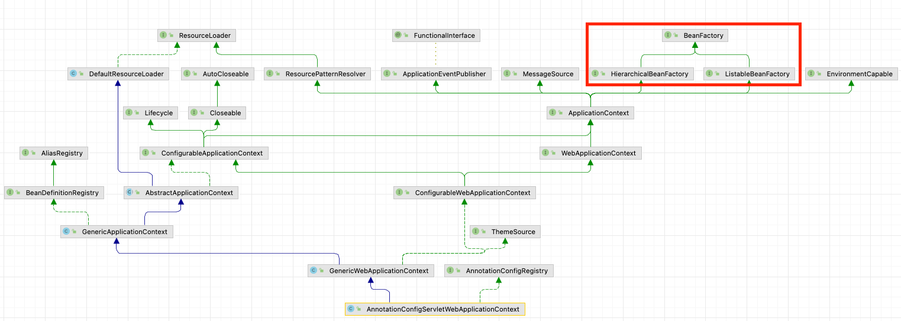
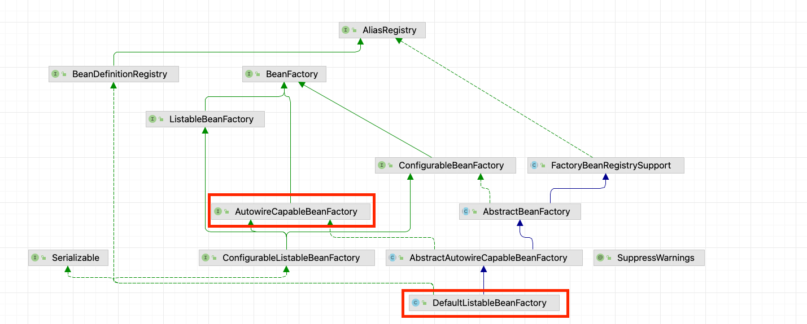

## ApplicationContext

### 정의

- 빈들을 생성 및 의존성 주입을 해주는 DI 컨테이너 입니다
- SpringBoot내부에서는 application종류에 따라서 구현체가 다릅니다

### 구현체

1. WebApplication아닌경우

- 구현체 : AnnotataionConfigApplicationContext

3. Spring MVC servlet 기반 web

- AnnotationConfigServletWebApplicationContext

3. reactive web programing인경우

- AnnotataionConfigReactiveWebServerApplicationContext

```java

@FunctionalInterface
public interface ApplicationContextFactory {
    ApplicationContextFactory DEFAULT = (webApplicationType) -> {
        try {
            switch (webApplicationType) {
                case SERVLET:
                    return new AnnotationConfigServletWebServerApplicationContext();
                case REACTIVE:
                    return new AnnotationConfigReactiveWebServerApplicationContext();
                default:
                    return new AnnotationConfigApplicationContext();
            }
        } catch (Exception ex) {
            throw new IllegalStateException("Unable create a default ApplicationContext instance, "
                    + "you may need a custom ApplicationContextFactory", ex);
        }
    };
}
```

### cf)

- Spring Boot 구동시 위 DEFAULT가 호출되어서 Context객체를 생성합니다
- 아래 SpringBoot 의 run method를 호출하게 되면 `createApplicationContext()`가 호출되고 `ApplicationContextFactory.DEFAULT` 값을 반환 합니다

```java
public class SpringApplication {
    public ConfigurableApplicationContext run(String... args) {
        // codes
        try {
            // .. codes
            context = createApplicationContext();
            // .. codes
        } catch (Throwable ex) {
            // ... codes
        }
    }
}
```

## DI Container

### BeanFacotry 상속 구조
- Application Context는 BeanFactory 구현 받습니다
- DI Container라고 불리는 이유는 Bean객체를 가져오는 getBean과 같은 기능을 제공하는 BeanFactory의 구현체기 때문입니다
- Spring에서는 Interface를 상속받아서 모두 Bean으로 등록할 경우 하나의 type에 대해서 여러개의 Bean객체를 가지는 경우가 존합니다.
- 2개 이상의 Bean객체를 반환하기 위해서 Spring에서 사용하는 Context구현체는 아래 사진과 같이 `HierarchicalBeanFactory`와 `ListableBeanFactory`를 상속 받아서 사용 합니다



### ListableBeanFactory
- 하나의 interface를 여러 객체가 상속을 받고, 전부 Bean객체로 등록하게 될경우 `Map<String, T>` type으로 DI를 받을 수 있습니다
- 위와 같은 케이스를 처리가능하도록 interface를 제공해주는 것이 ListableBeanFactory 입니다

```java
public interface ListableBeanFactory {
    <T> Map<String, T> getBeansOfType(@Nullable Class<T> type) throws BeansException;
}
```

### HierarchicalBeanFactory

- spring 에서 ApplicationContext를 계층구조로 설계할 수 있습니다
- 예를들어서 Servlet마다 다른 ApplicationContext를 가지고 그리고 모든 Servlet이 공용으로 ApplicationContext를 공용으로 상요하고 싶을경우가 있습니다
- 만약 Bean객체르 검색할 때 공용 Context와 개별로 사용하는 Context 중에 어디에 Bean객체가 등록되어 있는지 모를 수 있습니다
- Spring에서는 개별로 사용하는 Context에서 Bean객체가 조회가 안 될경우 공용 Context에 추가 조회합니다. 그리고 결과를 반환하도록 로직을 설계했습니다.
- Spring에서는 고용 Context는 모든 개별 Context가 접근 가능하므로 부모 같은 마음을 가지고 있다고 해서 부모라고 명명했고, 개별 Context는 자식으로 명명 했습니다 그리고 이걸 부모 자식이기 때문에 계층 구조로 명명 했습니다
- 위와 같은 이유로 `Hierarchical` 라는 명칭이 붙었습니다
- 실제 AbstractApplicationContext에서는 getParentBeanFactory()d


### AutowireCapableBeanFactory

1. 정의
- Spring에서는 `@Autowired`를 통해서 DI가 이뤄지게 됩니다.
- `@Autowired`처리를 위한서 사용하는 FactoryBean을 상속 받은 interface는 `AutowireCapableBeanFactory`입니다
- `ListableBeanFactory`와 `HierarchicalBeanFactory`를 구현한 구현체가 아니기 때문에 위의 class diagram에서는 확인할 수 없습니다

2. AutoWireCapableBeanFactory 사용

- 아래 사진을 보면 DefaultListableBeanFactory가 AutoWireCapableBeanFactory를 상속받은 구현체로 나와 있습니다

- code를 확인한 결과 `AnnotationConfigServletWebServerApplicationContext`가 상속 받은 클래스중에서 `GenericApplicationContext`에서 DefaultListableBeanFactory를 Has-A관계로 구성되어 있습니다
- `AnnotationConfigServletWebServerApplicationContext`는 결론적으로 `DefaultListableBeanFactory`를 통해서 `@Autowired`처리도 할 수 있으며 Bean객체 관리 도할 수 있습니다

```java
public class GenericApplicationContext extends AbstractApplicationContext implements BeanDefinitionRegistry {
  private final DefaultListableBeanFactory beanFactory;
}
```

### ConfigurableApplicationContext

- 위 BeanFactory interface를 상속받은 실제 구현체 class들은 모두 ConfigurableApplicationContext interface를 상속 받습니다
- 왜냐하면 context의 시작과 종료 등에 대한 라이프 사이클 마다 Eventlistener를 호출해서 ApplicationContext 생성 삭제를 감지해서 추가 처리를 행할 수 있습니다
- 그리고 Closable interface를 상속받았기 때문에 자원 해제를 추가 처리를 할 수 있습니다
  - 대표적으로 생성 시점에 등록한 ShutdownHook를 closable에서 호출해서 Bean객체에 대해서 자원을 해재 하는 역할을 합니다

