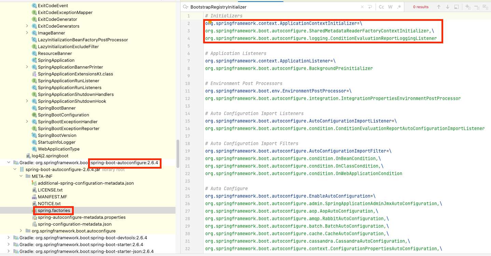

## SpringBoot 생성자 실행 과정

### Run method return type

- 아래 코드를 보면 SpringApplication 객체를 생성한 후 ConfigurableApplicationContext를 반환 하고 있습니다
- ApplicationContext를 생성하고 반환 하는 것을 의미합니다

```java
public class SpringApplication {
    public static ConfigurableApplicationContext run(Class<?> primarySource, String... args) {
        return run(new Class<?>[]{primarySource}, args);
    }
}
```

### SpringApplication생성

```java
public class SpringApplication {
    public SpringApplication(ResourceLoader resourceLoader, Class<?>... primarySources) {
        this.resourceLoader = resourceLoader;
        Assert.notNull(primarySources, "PrimarySources must not be null");
        this.primarySources = new LinkedHashSet<>(Arrays.asList(primarySources));
        this.webApplicationType = WebApplicationType.deduceFromClasspath();
        this.bootstrapRegistryInitializers = new ArrayList<>(
                getSpringFactoriesInstances(BootstrapRegistryInitializer.class));
        setInitializers((Collection) getSpringFactoriesInstances(ApplicationContextInitializer.class));
        setListeners((Collection) getSpringFactoriesInstances(ApplicationListener.class));
        this.mainApplicationClass = deduceMainApplicationClass();
    }
}
```

#### 전체 순서

1. 클래스 패스로부터 애플리케이션 타입을 추론
2. BootstrapRegistryInitializer를 불러오고 설정 진행
3. ApplicationContextInitializer를 찾아서 설정 진행
4. ApplicationListener를 찾아서 설정 진행
5. 메인클래스를 찾아서 설정 진행

#### 클래스 패스로부터 애플리케이션 타입을 추론
- 현재 애플리케이션 타입이 무엇인지를 판별
- Servlet/Reactive/NONE type으로 결정합니다
  - 나중에 WebApplicationContext 구현체를 정할때 사용합니다

#### BootstrapRegistryInitializer를 불러오고 설정 진행

- BootstrapRegistry(BootstrapContext)는 실제 구동될때 사용하는 애플리케이션 컨텍스트가 준비되는 경우와, 환경 변수들을 관리하는 스프링의 Environment 객체가 후처리되는 동안에 이용되는 임시 컨텍스트 객체입니다
- 초기에 애플리케이션이 준비되는 동안에는 실제 ApplicationContext를 생성하기 전이기 때문에 BootstrapRegistry를 사용합니다.
- BootstrapRegistry를 초기화하는데 사용하는 함수가 BootstrapRegistryInitializer의 initializer 입니다
  - initializer를 통해서 close listner를 등록을 합니다. 그리고 이 listner들은 ApplicationContext 준비 완료되어 BootstrapRegistry를 제거할 때 자원 제거 역할을 진행하기도 합니다
- BootstrapRegistryInitializer은 아래 코드를 보면 `SpringFactoriesLoader.loadFactoryNames(..)` static method를 호출 하는 것을 확인할 수 있습니다
- 해당 method를 이해하기 전에 `SpringFactoriesLoader`에서 읽어 드리는 auto-config의`spring.factory`를 먼저 확인해야 합니다
- `SpringFactoriesLoader`에서 auto-config의 `spring.factory` 파일을 읽어서 jpa설정과 같은 자동 설정이 필요한 interface와 구현체 path정볼르 읽어 오게 됩니다


- 그리고 읽어온 정보를 `SpringFactoriesLoader.loadFactoryNames` 내부에서 계속해서 반복해서 사용합니다
- `Set<String> names = new LinkedHashSet<>(SpringFactoriesLoader.loadFactoryNames(type, classLoader))` 에서는 구현체 정보를 가져옵니다

```java
public class SpringApplication {
  private <T> Collection<T> getSpringFactoriesInstances(Class<T> type, Class<?>[] parameterTypes, Object... args) {
    ClassLoader classLoader = getClassLoader();
    // Use names and ensure unique to protect against duplicates
    Set<String> names = new LinkedHashSet<>(SpringFactoriesLoader.loadFactoryNames(type, classLoader));
    List<T> instances = createSpringFactoriesInstances(type, parameterTypes, classLoader, args, names);
    AnnotationAwareOrderComparator.sort(instances);
    return instances;
  }
}
```

#### ApplicationContextInitializer 찾아서 설정

- BootstrapRegistryInitializer와 동일하게 `spring.factory`에 정의된 구현체 객체를 생성해서 설정 해주는 것 입니다
- 위의 사진을 참고하시면 됩니다

#### ApplicationListener 찾아서 설정
- BootstrapRegistryInitializer와 동일하게 동작합니다
- ApplicationListener의 구현체 정보를 불러오는 역할을 합니다
- ApplicationListener는 옵저버 패턴을 사용하면 event 발생시 handler를 처리하는 방식입니다

#### 메인클래스를 찾아서 설정 진행
- trace stack에서 main class를 찾아서 설정 합니다
- trace stack에서 찾은 메인 class는 나중에 run method에서 Logger를 만들어 로그를 남기거나 리스너를 등록하는 등에 사용될 예정입니다

