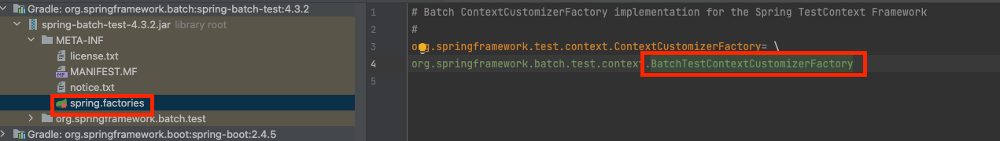
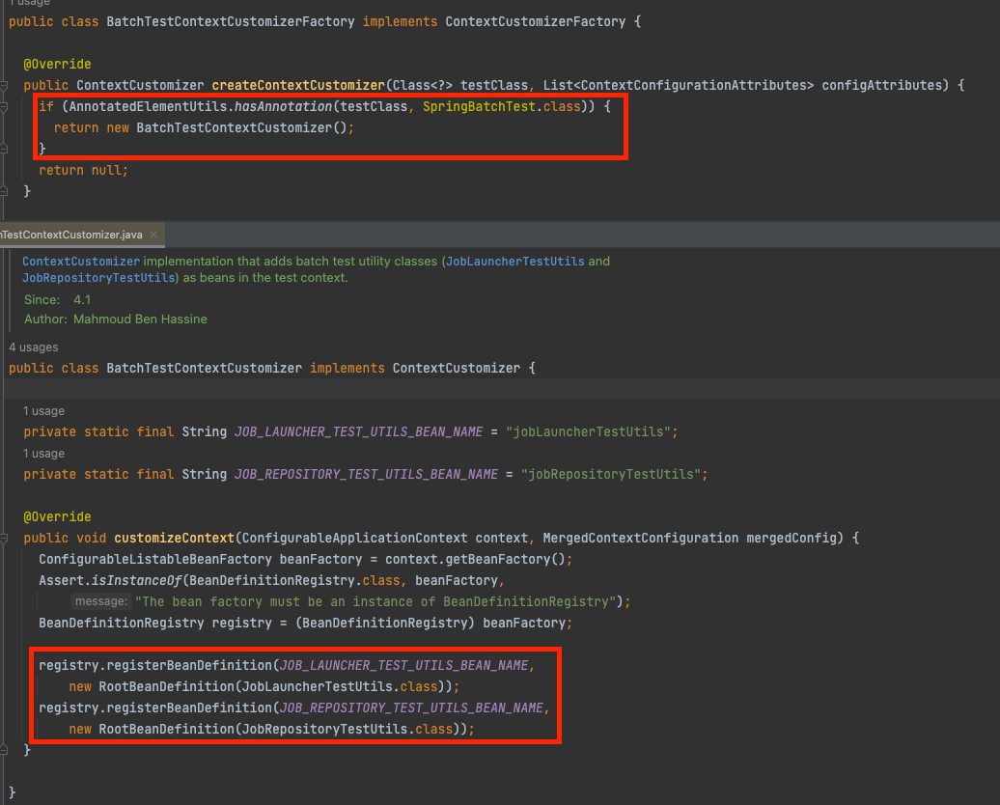
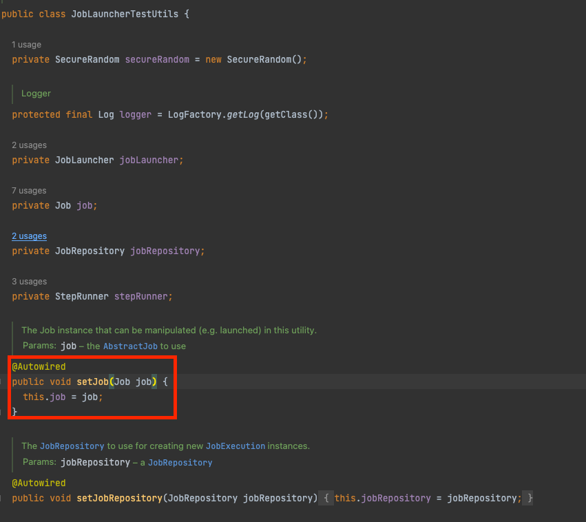
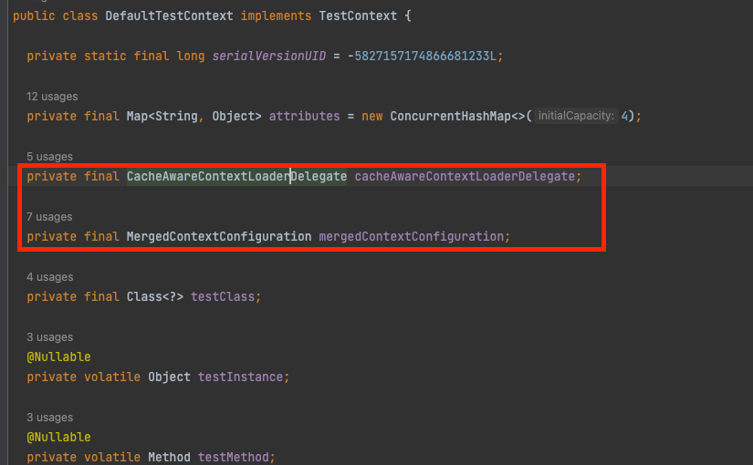

# 목차

1. Batch Test Code 작성

- 1.1 Batch 통합 테스트
- 1.2 SpringBatch Test Lib
- 1.3 Spring Batch Test Code 작성

2. Batch Test Code 문제점과 해결 방법

- 2.1 Job Bean 주입 이슈
- 2.2 Dirty Context 이슈
- 2.3 해결책

3. 회고

# 1. Batch Test Code 작성

## 1.1 Batch 통합 테스트

- QA를 위해서 가장 최적의 방법은 Test Code 작성입니다.
- 개발자가 입력과 출력을 하나씩 확인하는 방법이 있지만 Test Code 작성이 가장 안정적이고 편리합니다.
- Spring Batch에서 Unit Test를 통해 Reader Processor Writer 또한 테스트할 수 있지만, 이 글에서는 Spring Batch Step 들의 통합 테스트에 대해서만 다루도록 하겠습니다.

## 1.2 SpringBatch Test Lib

### 1.2.1 JobLauncherTestUtils

- Spring Batch Job을 테스트 환경에서 실행하게 만드는 Utils 클래스입니다
- @SpringBatchTest 을 붙이게 되면 자동으로 JobLauncherTestUtils이 Bean으로 등록이 됩니다

### 1.2.2 @SpringBatchTest

1. 정의

- Spring Batch test code에 필요한 설정을 지정해 주는 annotation 입니다
- 추가된 객체는 `StepScopeTestExecutionListener`, `JobScopeTestExecutionListener`, `JobLauncherTestUtils`, `JobRepositoryTestUtils` 입니다

2. auto config 설정



- 위 사진을 통해 Spring Batch 를 Test 에서 사용할 때 auto config를 통해서 `BatchTestContextCustomizerFactory` 객체를 가져온다는 것을 알 수 있습니다
- `BatchTestContextCustomizerFactory` spring 에서 `SpringFactoriesLoader` 를 통해서 가져와지며(Test Code 에서는 `TestContextBootstrapper`가 가져옵니다), 내부에 Bean을 생성하는 `ContextCustomizer` 를 생성합니다.



- `BatchTestContextCustomizer`는 `ContextCustomizer` 상속받은 객체입니다.
- 위 사진을 통해서 우리는 `ContextCustomizer`에서 `@SpringBatchTest`가 선언되어 있으면 자동으로 `JobLauncherTestUtils` 과 `JobRepositoryTestUtils` class 를 같이 Bean으로 등록한다는 것을 알 수 있습니다.

### 1.2.3 StepScopeTestExecutionListener

- Batch의 단위 테스트를 진행할 때 StepScope context를 생성해 줍니다
- 해당 context를 통해서 JobParameter 등을 단위 테스트에서 DI 받을 수 있음

### 1.2.4 JobScopeTestExecutionListener

- 배치 단위 테스트 시 JobScope context를 생성
- 해당 컨텍스트를 통해 JobParameter 등을 단위 테스트에서 DI 받을 수 있음

## 1.3 @SpringBatchTest 사용해서 Spring Batch Test Code 작성

### 1.3.1 Test Code 작성 사용하기

```java

@Configuration
@EnableBatchProcessing
public class TestBatchConfig {

}
```

- 기본 batch 설정을 해줍니다.

```java

@Configuration
public class TestJobConfig {

  @Bean
  public Job helloJob() {
    // ..codes
  }

  // step beans
}

@SpringBatchTest
@SpringBootTest(classes = {
    TestJobConfig.class, // job/step 이 선언된 config class
    TestBatchConfig.class // test batch config를 위해서 사용
})
class BatchTestExampleTest {

  public static final DateTimeFormatter FULL_DATE_TIME_FORMATTER = DateTimeFormatter.ofPattern("yyyy-MM-dd^HH:mm:ss");

  /**
   * 초기 환경 설정에 필요한 모든 util 객체가 들어있는 test 전용 class
   */
  @Autowired
  SetUpManager setUpManager;

  @Autowired
  JobLauncherTestUtils jobLauncherTestUtils;

  @Autowired
  JobRepositoryTestUtils jobRepositoryTestUtils;

  @AfterEach
  void tearDown() {
    jobRepositoryTestUtils.removeJobExecutions();
  }

  @Test
  void callBatchTest() {
    // given
    LocalDateTime 화요일 = LocalDateTime.of(
        2022,
        10,
        18,
        6,
        30,
        0
    );
    setUpManager.setUp(7, 7, 3, 3, 화요일);

    JobParameters parameters = new JobParametersBuilder()
        .addString("createTime", FULL_DATE_TIME_FORMATTER.format(화요일))
        .toJobParameters();

    // when
    String stepName = "stepNameStep";
    JobExecution jobExecution = jobLauncherTestUtils.launchStep(stepName, parameters);

    // then
    List<TestRecord> allRecords = overSeasSnpStockDao.findAll();
    List<TestRecord> normalRecord = allRecords.stream()
        .filter(it -> it.getStatus().equals(TestStatus.NORMAL.name()))
        .collect(Collectors.toList());

    List<TestRecord> excludedRecords = allRecords.stream()
        .filter(it -> it.getStatus().equals(TestStatus.EXCLUDED.name()))
        .collect(Collectors.toList());

    assertThat(jobExecution.getStatus()).isEqualTo(BatchStatus.COMPLETED);
    assertThat(normalRecord).hasSize(10);

    assertThat(excludedRecords).hasSize(0);
  }
}

```

- 위 코드는 일반 test code 의 예제 입니다

```java

@SpringBatchTest
@SpringBootTest(classes = {
    TestJobConfig.class, // job/step 이 선언된 config class
    TestBatchConfig.class // test batch config를 위해서 사용
})
class BatchTestExampleTest {
  // .. codes
}
```

- @SpringBatchTest 를 통해서 해당 Test code를 실행하면 자동으로 `JobLauncherTestUtils`, `JobRepositoryTestUtils`이 생성됩니다
- 추가로 `JobLauncherTestUtils` 이 생성될 때 Job Bean 또한 `@Autowired` 를 통해서 주입이 이뤄지게 됩니다.



- 위 사진과 같이 `JobLauncherTestUtils` Bean 내부에서 setter로 Job 객체를 주입해야 합니다. 하지만 같은 project에 `Job` Bean이 2개 이상일 때 충돌이 발생하게 됩니다.
- 만약 하나의 Job Bean 이름이 `job`일 경우 우선으로 주입이 이뤄져서 충돌 이슈가 발생하지 않습니다. 하지만 `job` 이라는 Bean 이름이 없으면 같은 type의 Bean 객체를 찾으므로 Primary로 우선순위를 표기하지 않으면 Bean 충돌 에러가 발생하게 됩니다.
- 이 문제를 해결하기 위해서 `@SpringBootTest` 의 `classes = {}` 를 통해 필요한 Bean 객체만 `ApplicationContext`에 넣어서 사용할 수 있습니다.
- 위 예제에서는 `TestJobConfig` config class 내부에 1개의 Job 객체가 선언되어 있으므로 Autowired에서 exception 없이 test code를 실행할 수 있습니다.
- 하지만 여러분들이 위 코드를 봤을떄 여러 문제들이 발생할 수 있을거 같다고 생각이 들 수 밖에 없을 것 입니다.
- 저는 위 문제를 2장에서 나열하고, 어떻게 해결 했는지를 알려드리겠습니다.

# 2. Batch Test Code 문제점과 해결 방법

## 2.1 Job Bean 주입 이슈

### 2.1.1 이슈 정의

- 위에서 언급했었지만 `@SpringBootTest`를 붙이면 `JobLauncherTestUtils`가 자동으로 생성된다.
- `JobLauncherTestUtils`가 자동으로 생성되면 아래와 같이 Setter를 통해서 Job Bean이 주입된다
  

- 이 문제의 해법은 위에서도 언급했지만, context를 제한해서 Job bean을 하나로 만드는 것이다.
- `@SpringBootTest(classes={})`의 `classes`에 꼭 필요한 Bean 객체만 등록한다면 일차적으로 문제를 해결할 수 있다.

### 2.1.2 추가 이슈

- `2.1.1` 에서 언급한 해결책은 Config file에 1개의 Job만 선언할 수 있는 하나의 제약 사항을 만듭니다.
- 그리고 구현체에 DI를 해야 하는 Bean이 늘어날수록 `classes`에 넣어야 하는 Bean class가 많아지므로 관리와 구현 모두에도 좋은 영향을 주지 않습니다.

## 2.2 Dirty Context 이슈

### 2.2.1 이슈 정의

1. 상황

- Spring 은 Bean 객체를 관리하는 `ApplicationContext`라는 Container가 존재합니다.
- Spring의 Test Code에서 Spring의 기능을 사용할경우 `ApplicationContext`를 생성하게 됩니다.
- Test Code 는 모든 Test code에 대해서 각각 `ApplicationContext`를 띄우지 않고 성능을 개선하기 위해서, 같은 상태의 `ApplicationContext`일 경우 기존에 생성한 `ApplicationContext` 를 사용합니다.
- 결론적으로 `ApplicationContext` 상태를 통일 시켜주는 건 test code의 성능을 끌어내는 중요한 요소입니다.
- Dirty Context는 `ApplicationContext`의 상태가 다른 test code가 존재하기 때문에 새로운 `ApplicationContext`를 만드는 것입니다.

2. TestContext



- Junit 에서는 Test Code를 실행할 때 TestContext(default 구현체: DefaultTestContext)를 통해서 TestApplicationContext 목록 관리 및 test 상태 관리를 담당하고 있습니다.
- 위 사진에서 우리가 집중해야 하는 것은 `CacheAwareContextLoaderDelegate`, `MergedContextConfiguration`이다.
- `MergedContextConfiguration`는 현재 Test code가 있는 class와 test class의 부모 클래스의 context 정보를 병합해서 가지고 있습니다(`ApplicationContext`가 아닙니다).
- MockBean 이 몇 개 있고, 일반 Bean 으로 생성해야 하는 객체가 무엇이 있는지, active profile 이 어떤 것인지 등 Spring TestCode에 필요한 정보가 담겨 있습니다.
- 나중에 `SmartContextLoader`은 `MergedContextConfiguration`를 이용해서 `ApplicationContext` 를 생성하게 됩니다.
- 그리고 `CacheAwareContextLoaderDelegate`객체는 기존에 `ApplicationContext`를 로드 후 `MergedContextConfiguration` key value로 관리하고 캐시 같은 객체 입니다.
- TestContext는 `ApplicationContext`를 가져올 때 `CacheAwareContextLoaderDelegate`로 부터 `MergedContextConfiguration`와 매칭 되는 `ApplicaitonContext`를 가져옵니다.
- 결론적으로 `MergedContextConfiguration`의 구성이 동일하면 `CacheAwareContextLoaderDelegate`로 부터 캐시된 `ApplicationContext`를 가져올 수 있습니다.

### 2.2.2 위 코드의 Dirty Context 이슈

```java

@SpringBatchTest
@SpringBootTest(classes = {
    TestJobConfig.class, // job/step 이 선언된 config class
    TestBatchConfig.class // test batch config를 위해서 사용
})
class BatchTestExampleTest {

}
```

- 위 코드는 1장의 예제 코드의 일부분입니다.
- 위 코드에서 `@SpringBootTest(classes={})`로 **하나의 test 코드에만 필요한 Bean 객체를 넣어 줬습니다.**
- 결론적으로 다른 Job test code를 작성할때 `@SpringBootTest(classes={})`의 `classes` 의 목록이 달라지고, DirtyContext 가 생기게 됩니다.

## 2.3 해결책

### 2.3.1 @SpringBootTest 제거

- @SpringBootTest 를 제거하면 `JobLauncherTestUtils`이 Bean 으로 자동으로 등록되지 않는다
- 결론적으로 Job Bean Conflict Exception를 제거할 수 있고, SpringBootTest 를 선언 후 `classes`에 Job에 필요한 Bean 클래스를 넣어줄 필요도 없어집니다.
- 결론적으로 DirtyContext와 Bean Conflict 문제 모두 다 해결이 됩니다.
- 하지만 어떻게 `JobLauncherTestUtils` 생성하느냐가 문제입니다.

### 2.3.2 JobLauncherTestUtils 수동 생성

- `JobLauncherTestUtils`의 내부를 까보면 단순합니다. Job을 주입하는 것 외에는 Spring DI를 통해서 주입을 해주는 로직 또한 거의 없습니다.
- 결론적으로 저는 수동으로 `JobLauncherTestUtils`를 생성하기로 하였습니다.

```java

@Configuration
public class TestJobConfig {

  @Bean
  public Job helloJob() {
    // ..codes
  }

  // step beans
}

@SpringBootTest
class BatchTestExampleTest {

  public static final DateTimeFormatter FULL_DATE_TIME_FORMATTER = DateTimeFormatter.ofPattern("yyyy-MM-dd^HH:mm:ss");

  JobLauncherTestUtils jobLauncherTestUtils;

  /**
   * 초기 환경 설정에 필요한 모든 util 객체가 들어있는 test 전용 class
   */
  @Autowired
  SetUpManager setUpManager;

  @Autowired
  protected JobLauncher jobLauncher;

  @Autowired
  protected JobRepository jobRepository;

  @Autowired
  JobRepositoryTestUtils jobRepositoryTestUtils;

  @Autowired
  TestJobConfig testJobConfig;

  @BeforeEach
  void setUp() {
    jobLauncherTestUtils = new JobLauncherTestUtils();
    jobLauncherTestUtils.setJob(testJobConfig.helloJob());
    jobLauncherTestUtils.setJobLauncher(jobLauncher);
    jobLauncherTestUtils.setJobRepository(jobRepository);
  }

  @AfterEach
  void tearDown() {
    jobRepositoryTestUtils.removeJobExecutions();
  }

  @Test
  void callBatchTest() {
    // given
    LocalDateTime 화요일 = LocalDateTime.of(
        2022,
        10,
        18,
        6,
        30,
        0
    );
    setUpManager.setUp(7, 7, 3, 3, 화요일);

    JobParameters parameters = new JobParametersBuilder()
        .addString("createTime", FULL_DATE_TIME_FORMATTER.format(화요일))
        .toJobParameters();

    // when
    String stepName = "stepNameStep";
    JobExecution jobExecution = jobLauncherTestUtils.launchStep(stepName, parameters);

    // then
    List<TestRecord> allRecords = overSeasSnpStockDao.findAll();
    List<TestRecord> normalRecord = allRecords.stream()
        .filter(it -> it.getStatus().equals(TestStatus.NORMAL.name()))
        .collect(Collectors.toList());

    List<TestRecord> excludedRecords = allRecords.stream()
        .filter(it -> it.getStatus().equals(TestStatus.EXCLUDED.name()))
        .collect(Collectors.toList());

    assertThat(jobExecution.getStatus()).isEqualTo(BatchStatus.COMPLETED);
    assertThat(normalRecord).hasSize(10);

    assertThat(excludedRecords).hasSize(0);
  }
}

```

- 위 코드가 최종 코드입니다. 여기서 가장 중요하게 봐야 할 부분이 `@BeforeEach` 부분 입니다.
- `JobLauncherTestUtils` 를 `@BeforeEach` 에서 직접 생성 후 DI로 주입해 주었던 `Job`, `JobLauncher`, `JobRepository`를 주입해 주었습니다.
- 결론적으로 DirtyContext와 DI 충돌 이슈를 간단하게 해결할 수 있었습니다.

# 3. 회고

- 필자는 `SpringBatch`를 사용하면서 test code 작성에서 어려움을 느끼고 수정하였습니다.
- 위의 내용은 저가 시행착오 과정에서 알게 된 사실과 간단하게 해결해 나가는 방식을 서술하였습니다.
- 대단한 방식은 아니지만, 위와 같은 방식으로 test code를 작성하여 성능을 약 40% 정도 향상하게 시켰습니다.