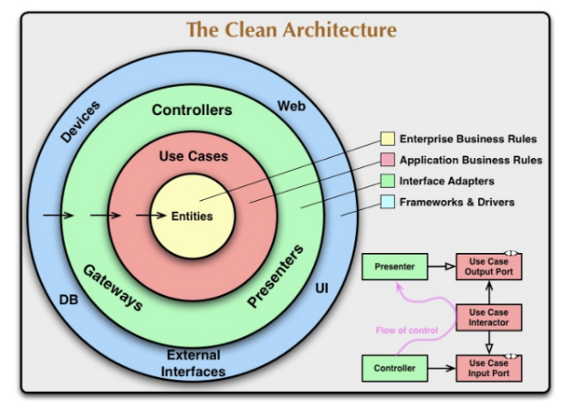
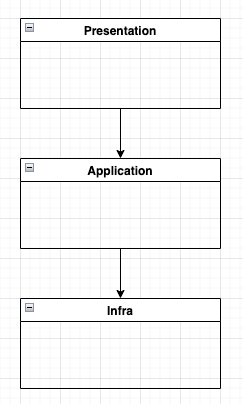
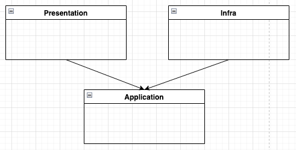
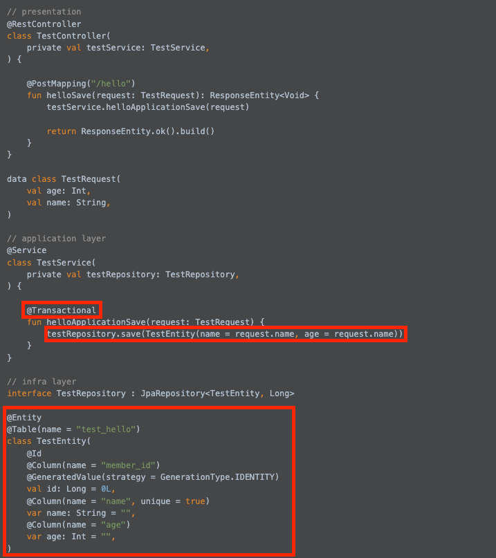
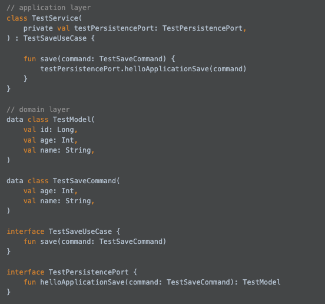
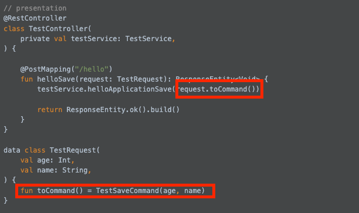
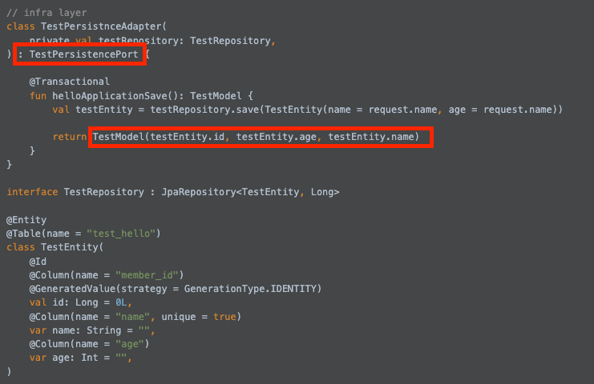
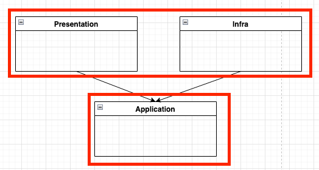
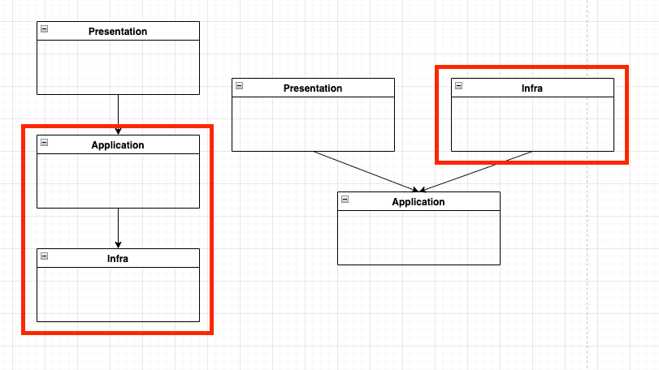

# 1. Hex 아키텍처

## 1.1 정의

### 1.1.1 정의



- 인터페이스나 기반 요소(infrastructure/presenation)의 변경에 영향을 받지 않는 핵심 코드를 만들고, 이를 견고하게 관리하는 것이 목표로 하는 아키텩처를 의미 합니다.
- 견고해야하는 핵심 로직이 들어있는 영역을 도메인 영역(Domain)이라고 합니다
- interface 기반의 요소는 세부 사항이라고 합니다
- 데이터 flow는 presentation(세부사항) -> domain(use case/domain) -> infra(세부사항) 이지만, 의존성은 세부사항 -> domain(use case/domain) 로 구성 됩니다

### 1.1.2 용어

- Hex 아키텍쳐는 Application과 Domain 영역을 분리해서 보여줍니다
    - domain엔 주로 업무 로직을 포함하는 클래스들이 들어섭니다, 업무 로직의 validation과 port interface, UseCase interface, Domain Model Entity class(Jpa Entity가 아닙니다)가 존재합니다.
    - application은 주로 domain 영역의 유스케이스(use case) interface를 상속 받은 클래스를 포함하고, 업무 로직이 거의 없고 domain의 여러 업무 로직을 조합하는 역할을 합니다 -> validation, port interface 호출 등을 담당
    - Hex 아키텍쳐는 Domain 영역과 Application layer를 분리하지만, 아래는 설명에 용의를 위해 Application/Domain 영역으로 용어를 통일하겠습니다.
- 세부사항들은 여러가지 입니다.
    - api의 web 이나 kafak consumer 와 같은 end point 지점을 presentation layer 들이 있습니다.
    - api 는 rest api 일 수 있고, GraphQL, gRPC 등으로 변경이 이뤄질 수 있기 때문에 세부 사항 입니다.
    - kafak consumer 또한 아마존 SQS, Spring EventListner 등으로 쉽게 변경될 수 있기 때문에 세부 사항 입니다
    - DB persistnce, 외부 api 호출 등 데이터 적제 및 외부 서버 API 호출 등 비즈니스 로직에 필요한 재료들을 통합해서 infra layer 라고 합니다

## 1.2 특징과 필요성

### 1.2.1 비즈니스 로직과 세부 사항 정의

- 세부 사항은 언제나 변합니다.
- 비즈니스 로직은 기획자가 새로운 기획을 내놓지 않는 이상 변하지 않습니다.
- ex) 물건을 산다고 가정하겠습니다
    - 비즈니스 로직
        - 장바구니 정보를 입력 받는다
        - 내 계정 정보를 입력 받는다
        - 장바구니에 있는 정보를 저장 합니다
        - 물품의 잔고량을 검사하고, 만약 주문량보다 잔고량이 더 많을 경우 잔고량을 줄이고 구메 물건을 등록 합니다
        - 운송 시스템에 물건들과 배송지 정보를 전달 합니다
        - 결제를 진행합니다

- 위의 예시는 하나의 비즈니스 로직입니다. 내가 현재 모노리식 아키텍쳐일 경우 모든 작업이 하나의 서버에서 이뤄 지던지, 아니면 운송시스템, 결제 시스템 등으로 나줘져 있어서 rest api를 쓰든지, kafka Event로 비동기 처리를 한다든지..etc
- 우리는 비즈니스 로직을 실행하기 위해서, 요청이 들어오게 되면 위 목록을 실행하는 각각의 API들을 호출하게 됩니다.
- 그리고 나중에 서비스가 잘되서, 하나의 팀이 여러개의 팀으로 분리가 되고, 모놀리식 아키텍처를 여러 서비스로 나누게 된다며 DB 요청이 rest api로 변경되거나, Kafka로 변경되는 경우가 있습니다.
- 위의 DB 요청이 rest api, kafka 로 변경되더라도 중요한 것은 validation과 같이 비즈니스 정책들과 비즈니스 로직은 변경되지 않는 다는 것 입니다. 그러므로 우리는 비즈니스 로직을 잘 변경 되지 않는 안전한 지역 이라고 간주하게 됩니다.
- 반대로 DB, rest api, Kafka는 언제나 변할 수 있습니다. 서비스 성능을 위해서 rest api 대신 비동기 처리인 Kafka를 쓴다든지, 원래 하나의 DB에서 처리하는 것을 다른 서버로 분리해서 처리한다든지와 같이 불안전하게 계속 변경될 수 있습니다.
- 심지어 어느 조직은 Spring을 사용하다가 Kotar로 프레임워크 변경도 진행하기도 합니다. 우리는 이렇게 변경이 잦고 수정이 다수 이뤄지는 영역을 불안정 지역이라고 명명합니다.
- 만약 Kafka 호출과 rest api 호출과 같이 불안정한 영역을 interface로 정의하여 구현체와 분리하게 된다면, 우리는 세부 사항(구현체)를 편리하게 바꿔 치기 할 수 있습니다. 그러면 비즈니스 로직 수정 없이 세부 사항(구현체)를 바꿀 수 있습니다.
- Hex 아키텍쳐는 위의 내용을 담고 있는 아키텍쳐 입니다
- 우리는 이 아키텍쳐를 흔히 port(interface) adapter(구현체) pattern 이라고도 부르기도 합니다.

### 1.2.2 아키텍처 구조

1. 기존 가장 많이 사용하는 아키텍쳐 구조(3 티어)



- api 호출이 이뤄지는 presentation layer, 비즈니스 로직이 있는 application layer, DB에 에터 적제 및 외부 API호출 하는 infra 영역 3가지로 나뉘게 됩니다
- presentation layer는 core인 application layer를 참조 합니다
- application layer는 DB가 있는 infra를 참조합니다
- data 흐름과 module 간의 의존성이 동일 합니다

2. hex 아키텍처
   

- api 호출이 이뤄지는 presentation layer, 비즈니스 로직이 있는 application layer, DB에 에터 적제 및 외부 API호출 하는 infra 영역 3가지로 나뉘게 되는건 동일 합니다
- 그리고 data flow 또한 presentation layer -> application layer -> infra로 3티어 아키텍쳐랑 동일합니다
- 하지만 모듈 간의 의존성이 달라 집니다
- persentation 과 infra 는 application layer를 의존합니다

### 1.2.3 코드를 통한 아키텍처 설명

1. 3 티어 구조 예제 코드

```kotlin
// presentation
@RestController
class TestController(
    private val testService: TestService,
) {

    @PostMapping("/hello")
    fun helloSave(request: TestRequest): ResponseEntity<Void> {
        testService.helloApplicationSave(request)

        return ResponseEntity.ok().build()
    }
}

data class TestRequest(
    val age: Int,
    val name: String,
)

// application layer
@Service
class TestService(
    private val testRepository: TestRepository,
) {

    @Transactional
    fun helloApplicationSave(request: TestRequest) {
        testRepository.save(TestEntity(name = request.name, age = request.name))
    }
}

// infra layer
interface TestRepository : JpaRepository<TestEntity, Long>

@Entity
@Table(name = "test_hello")
class TestEntity(
    @Id
    @Column(name = "member_id")
    @GeneratedValue(strategy = GenerationType.IDENTITY)
    val id: Long = 0L,
    @Column(name = "name", unique = true)
    var name: String = "",
    @Column(name = "age")
    var age: Int = "",
)
```

- 위 코드는 우리가 많이 접하는 3티어 아키텩처 이다

2. 3티어 코드의 문제점

- application layer에 많은 의존성이 들어간다
    - presentation layer 범위 침범
      
    - infra layer 범위 침범
      
- 위사진을 본다면 application 에 많으 세부사항들 포함된걸 알수 있다.
- 돌발 미션으로 만약 RDS에서 redis 로변경할 경우 어떻게 할것인가?, rest api 에서 graphQL로 변경하면 어떻게 대응할 것인가?
- 이경우 모든 변경사항에 대해서 application layer가 변경되어야 합니다
- 또한 request/response 객체가 application layer에 존재하기 때문에 application layer presentation layer 간의 모듈 분리또한 힘들어집니다.

3. hex 아키텍쳐

```kotlin
// presentation
@RestController
class TestController(
    private val testService: TestService,
) {

    @PostMapping("/hello")
    fun helloSave(request: TestRequest): ResponseEntity<Void> {
        testService.helloApplicationSave(request.toCommand())

        return ResponseEntity.ok().build()
    }
}

data class TestRequest(
    val age: Int,
    val name: String,
) {
    fun toCommand() = TestSaveCommand(age, name)
}

// application layer
class TestService(
    private val testPersistencePort: TestPersistencePort,
) : TestSaveUseCase {

    fun save(command: TestSaveCommand) {
        testPersistencePort.helloApplicationSave(command)
    }
}

// domain layer
data class TestModel(
    val id: Long,
    val age: Int,
    val name: String,
)

data class TestSaveCommand(
    val age: Int,
    val name: String,
)

interface TestSaveUseCase {
    fun save(command: TestSaveCommand)
}

interface TestPersistencePort {
    fun helloApplicationSave(command: TestSaveCommand): TestModel
}

// infra layer
class TestPersistnceAdapter(
    private val testRepository: TestRepository,
) : TestPersistencePort {

    @Transactional
    fun helloApplicationSave(): TestModel {
        val testEntity = testRepository.save(TestEntity(name = request.name, age = request.name))

        return TestModel(testEntity.id, testEntity.age, testEntity.name)
    }
}

interface TestRepository : JpaRepository<TestEntity, Long>

@Entity
@Table(name = "test_hello")
class TestEntity(
    @Id
    @Column(name = "member_id")
    @GeneratedValue(strategy = GenerationType.IDENTITY)
    val id: Long = 0L,
    @Column(name = "name", unique = true)
    var name: String = "",
    @Column(name = "age")
    var age: Int = "",
)
```

- 위코드는 hex 아키텩처 입니다
- 코드가 많아 지고 복잡해 보여집니다. 하지만 하나씩 뜯어보면 의존성이 분리 되는 과정을 이해할 수 있습니다
- 가장 먼저 domain 과 application 영역을 보겠습니다
  
    - 특이점은 application layer는 domain 영역의 DTO(Model/command) class와 interface만 사용 합니다
    - 어떤 외부 요소들(request, `@Transactional`등)에 의존 하지 않습니다
- presentation layer 영역을 보겠습니다

  
    - 위 코드를 보면 presentation layer와 domain layer의 코드만 의존하고 있습니다
    - 즉 presentation layer는 application/domain 영역을 의존하지만 반대는 성립하지 않습니다
    - 또한 application/domain 영역의 method는 필수적으로 application/domain 영역의 Model 클래스로 반환을 해줘야 합니다
    - 결론적으로 위에서 언급한 domain/application 영역과 presentation layer간의 모듈 분리가 가능해지고, web/kafka와 같은 기술 로부터 논리적으로 분리가 됩니다
- infra layer 영역을 보겠습니다
  
    - infra layer에서는 application/domain 영역의 interface를 상속 받습니다.
        - 위와 같이 interface 를 통해 의존성을 다른 모듈로 바라 보게 만드는 것을 DIP라고하는데 현재 코드가 DIP의 대표적인 예시입니다
        - interface는 application/domain 모듈에 있으므로 infra layer는 필수적으로 application/domain 모듈을 의존해야 합니다
        - 반대로 application/domain 는 infra layer에서 어떤 것이 Bean으로 등록되어서 사용될지 모르고 오직 자신의 모듈에 존재하는 interface만 호출해서 비즈니스 로직을 설계 하면 됩니다
    - application는 interface를 통해 infra layer의 로직을 실행할 경우 필수적으로 domain 영역에 정의된 객체로 변경해서 반환 해줘야 합니다.
        - JPA Entity class(JPA의 Entity class는 JPA Entity class로 명명하겠습니다)를 infra layer에서 반환할 경우 application/domain는 필수적으로 infra 모듈을 의존 해야 합니다
        - 결론적으로 싸이클이 생기는 이슈가 존재합니다. 저희는 이를 해결 하기 위해서 AggreteRoot 라는 model class를 만들 었습고, 현재 예제에서는 TestModel 입니다.
        - AggreteRoot는 하나의 비즈니스 domain 영역(결제/빌링/주문)에서 가장 주축이 되는 Entity/Model 객체를 의미하고, AggregateRoot 객체는 생명주기를 같이 하는 여러개의 sub class 들을 가지고 있습니다
            - 주문일 경우 주문(AggreteRoot)는 주문 상품정보들(OrderItem: 제품 + 개수 정보가 담긴 객체)를 sub class로 가집니다
            - 만약 주문 객체가 삭제 되면 주문 상품정보는 의미가 없어지기 때문에 삭제해도 무방합니다. 결론적으로 생명주기를 동일하게 가져 갑니다
            - cf) 이부분을 더 공부하고 싶은신 분이 있다면 DDD라는 책을 읽어 보시길 바랍니다
    - 위2개의 규칙을 지키게 된다면 자연스럽게 infra layer 또한 applicaiton/domain 모듈을 의존 하는 구조가 되고, 반대는 이뤄지지 않습니다
- hex 아키텍쳐 예제를 통해서 우리는 applicaiton/domain 모듈을 가장 안정지대인 아래에 위치시킬 수 있고, 세부 사항들을 불안정한 모듈로 분류해서 위쪽에 위치 시킬 수 있습니다
  

4. Hex 아키텍쳐에서 Rds 에서 Redis로 전환 해보기

- 3티어와 hex 아키텩처 에서 각각 Redis 로 전환할 경우 영향이 가는 layer는 아래와 같습니다
- @Transactional를 모두 제거하고, Entity class 를 모두 Redis 의 Dto class 로변경해야 합니다, 그리고 redis 와 관련된 interface를 상요하게 되면 아래 사진의 사각형 정도만 변경이 이뤄집니다
  
- 우리는 사진을 통해 영향도가 확실히 줄었다는 것을 인지할 수 있습니다
- 그리고 비즈니스로직 변경 없이는 비즈니스 로직 변경 코드 또한 변경이 이뤄지지 않는 다는 것을 의미하게 되었다는 것을 알게 되었습니다.
- 마지막으로 applicaiton/domain 영역은 어떠한 **의존성** 을 가지지 않으므로 자유롭고 안정화된 영역을 가지게 되었습니다

# 2. Layer 구조

## 2.1 모듈 종류

1. Domain: 우리가 사용하는 비즈니스 로직 입니다
2. End Point/Main: DI 설정과 Spring 과같은 framework 설정, Rest API, Kafka Consumer 등이 위치한 입력 End point를 의미 합니다
3. infra/Adapter: 세부 사항들의 집합
    - RDB
    - Redis
    - Kafka
    - ...etc

## 2.2 EndPoint

### 2.2.1 EndPoint Response 와 Domain 객체

- 우리는 위 예제를 통해서 Application/Domain 영역 또한 presentation layer에 데이터를 반환해줄 때 Domain 객체로 반환해줘야 한다고 했었습니다
- 실제로 front end 에서 보여지는 데이터 들은 여러 비즈니스 domain(결제/빌링/주문)에서 데이터를 조합해서 하나로 합쳐서 반환해야 합니다
- 이런 합성을 Application/Domain 영역에서 처리하게 된다면 web/kafka DTO class간의 강한 결합이 발생하게 되고, 비즈니스 domain(결제/빌링/주문)단위로 pacakge로 분리한 이유가 사라지게 됩니다
- 한 마디로 스파게티 의존성과 싸이클이 난무하게 됩니다. 이를 해결하기 위해서 **퍼사드 패턴**을 사용하게 되었습니다.

### 2.2.2 퍼사드 패턴

- 정의: 여러 세부적인 이터페이스를 하나의 추상화된 인터페이스로 치환해주는 디자인 패턴 입니다
- 퍼사드 객체에서 Application/Domain 영역에 필요한 API들을 호출해서 AggreteRoot Model 객체들을 반환 받게 됩니다. 그리고 고객이 필요한 필요한 정보를 filter해서 Resposne 객체로 만들어서 Controller에서 전달 합니다
- 위 내용을 통해 우리는 퍼사드 객체는 presentation layer의 객체 입니다.

# 3 Hex 아키텩처와 접목과 오버 엔지니어링

## 3.1 Hex 아키텍쳐를 사용할 경우 오버 엔지이링인 경우

- 스타트 업인 경우 고객들에게 빠르게 상품을 보여주고 피드백을 받아야 하는 경우
    - 프로젝트가 쉽게 사라지고 생성되고, 빠르개 배포 해야 하므로 굳이 많은 모듈로 나눌 이유가 없습니다
    - 나중에 해당 프로젝트에 고객이 일정 만큼 유지가 될 경우 전환을 하는 것을 추천 드립니다
- 캐시와 RDB 정도와 백오피스 배치 정도 제공되고 있습니다
    - 외부 adapter 가 단순하고 거의 없는 경우 대부분 domain 영역에 로직이 없는 경우가 많습니다.
    - 이경우에는 오버엔지니어링이 될 가능성이 많습니다
- 추가적으로 비즈니스 domain 영역(결제/빌링/주문)이 적은 경우
    - 비즈니스 domain은 package 단위로 나누는 경우가 많습니다. package 단위로 나누고 서비스 트래픽이 증가될 경우 분리 하는 것이 일반적이기 떄문 입니다
    - 그러므로 package가 1, 2가지 밖에 없을 경우 굳이 복잡한 아키텍처를 가져가게 되면 개발 시간이 더 느려질 수 있습니다

## 3.2 Hex 아키텍쳐를 도입하면 좋은 케이스

- 외부 Adapter가 많은 경우
    - 현재 회사에서는 외부 Adapter가 많았습니다. DB만 3개, 외부 API 2가지 이상이었기 떄문에 접목하게 되었습니다
- 비즈니스 domain 영역(결제/빌링/주문)이 많은 경우: 비즈니스 domain 이 많은 경우 나중에 비즈니스 domain 을 외부 서버로 분리하는 작업을 할 수 있습니다
- 구현체가 자주 변경될 경우
    - 외부 API -> Kafka로 변경, RDS 에서 NoSQL로 변경되는 등 adapter 구현체가 자유롭게 변경 되는 경우
    - 전직장에서는 구현체가 adapter 방식이 자주 변경되었습니다. 그 당시 비즈니스 domain 영역은 많지 않았지만, 잦은 adapter(세부사항)변경으로 인해서 Hex 아키텍처를 접목하였습니다
    - 실제로 전환 후, 구현체 변경이 추가로 필요할 경우 손쉽게 변경할 수 있어서 편리했었습니다
