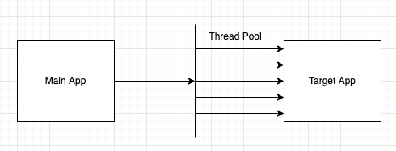
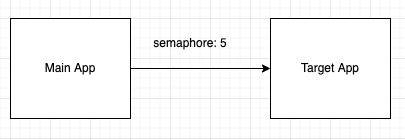

# Resilience4J

## 정의

- Netflix에서 개발하고 제공해줬던 Hystrix에서 염감을 받아서 Java8의 함수형 문법을 기반으로 제작한 fault tolerance 라이브러리 입니다

## Hystrix 와 Resilience4J

### 외부 라이브러리 참조 차이

- Hystrix는 외부 라이브러인 Guava 와 Apache Commons Configuration을 종속하고 있는 Archaius를 의존하고 있습니다
- 하지만 Resilience4J는 외부 라이브러리 종속 없는 [Vavr](https://www.vavr.io/)라는 것을 사용고 있습니다
    - cf) vavr: java를 위한 funcational 라이브러를 제공하는 오픈 소스입니다
- 현재 Hystrix는 더이상 관리되지 않기 때문에 Hystrix를 대체 하기 위해서 Resilience4J 를 사용하게 되었습니다
- 현재 Resilience4J는 계속해서 update가 되고 있습니다

### Thread isolation(Hystrix)과 BulkHead(resilience4J)

1. Hystrix는 Thread Isolation semaphore 방식과 Thread pool방식이 존재합니다

- Thread Pool: caller Thread가 application thread를 낚아 채서 외부 API를 호출 하게 됩니다
  
- Semaphore 방식: API를 호출할 target Application에 한번에 동시에 호출 가능한 횟수를 semaphore형태로 가지고 있습니다.
  
- Semaphore방식은 thread pool과 달리 main application의 thread가 API를 호출하기 때문에 중간에 timeout이 발생할 경우 중간에 바로 멈추는 것이 불가능 합니다
- 하지만 thread pool은 외부의 thread를 호출 하기 때문에 timeout 이 발생하면 바로 중간에 main application thread를 return하면 됩니다. 결론적으로 timeout 시간을 명확하게 지켜야할 경우 thread pool을 사용하면 좋습니다

2. BulkHead(resilience4J)

- SemaphoreBulkhead
    - semaphore 를 사용해서 동시에 실행 되는 횟수를 제한 합니다
    - limit 횟수 이상으로 요청할 경우 Reject 시킴
- FixedThreadPoolBulkhead
    - 고정된 thread pool과 bounded queue를 사용합니다
    - thread pool을 사용, 만약 모든 thread pool이 사용될 경우 queue에 적제해서 대기 하게 됩니다
    - 모든 thread pool이 사용중이며, queue가 꽉찰 경우 reject가 발생 합니다
    - hystrix에서 제공하고 있는 isolation과 동일하다고 생각 하시면 됩니다

3. RateLimit(resilience4J)

- 정의: 일정 시간동안 target application/method호출 요청 횟수를 제한하는데 기능을 의미 합니다
- 특징
    - 클라이언트가 설정된 rate limit을 초과 한 경우 추가 요청을 거부하거나, 나중에 처리하거나(Queue 적제), 더 적은 양의 리소스를 할당할 수 있다
    - 파라미터 종류
        - limit-for-period: 5
        - limit-refresh-period: 4s
        - timeout-duration: 10s
    - 파라미터 해설:
        - 처음에 `limitForPeriod`에 설정된 갯수 만큼만 한번에 처리가 가능합니다
        - 그리고 다음 `limitForPeriod` 개수만큼 처리하기 위해서 `limitRefreshPeriod` 만큼 기다려야 합니다
        - 하지만 모든 요청은 `timeoutDuration`을 넘기면 안되기 때문에 `timeoutDuration`를 넘기게 되면 에러가 발생하게 됩니다
        - ex) 아래와 같이 설정될 경우 한번에 처리 가능한 요청 개수는 5개 입니다. 그리고 4초 간격으로 다음 5개의 요청을 처리합니다. 마지막으로 10초가 지난 요청들은 timeout을 띄웁니다
            - limit-for-period: 5
            - limit-refresh-period: 4s
            - timeout-duration: 10s

## 부록

### [BulkHead Pattern](https://www.vinsguru.com/bulkhead-pattern/)

1. 참고 링크 [추가 링크](https://docs.microsoft.com/ko-kr/azure/architecture/patterns/bulkhead)

2. 정의

- 애플리케이션을 풀로 격리되므로 실패하는 경우 다른 요소가 계속 작동할 수 있도록 방지해주는 패턴 입니다.
- service의 독립적인 scale을 설정할 때 사용

3. 문제점

- Cloud 환경에서는 한개의 애플리케이션은 여러 서비스로 분할 해서 사용하게 됩니다. 그리고 애플리케이션은 한번에 여러 서비스에 요청을 보낼 수 있습니다.
- 하지만 하나의 서비스에서 에러가 발생할 경우 retry를 보내는 과정과 에러 처리 과정에서 connection을 계속 맺고있기 때문에 리소스 사용이 계속 되고 있습니다
- 그러므로 오직 한 곳에서 에러가 발생하게 되면 다른 서비스의 리소스를 계속 점유하고 있기 때문에 영향이 갈 수 밖에 없는 문제가 발생합니다

4. 해결 방법

- 서비스 별로 소비자의 부하를 예상해서 서비스 별로 scale out을 설정 합니다
- database와 같이 각 서비스가 각각 따로 분리해서 사용할 수 있는 자원일 경우 분리해서 자원을 사용하는 것도 하나의 방법입니다

5. Spring Cloud BulkHead Pattern

- circuit breaker또한 BulkHead Pattern을 일부분을 상요하고 있습니다
- 각 서비스 간의 의존성이 존재합니다, 예를 들어서 A service 는 B service의 API를 호출할 경우 A는 B서비스를 의존하고 있습니다
- 하지만 B서비스의 API는 A service 말고 C,D,E서비스 에게도 API를 제공하고 있습니다
- 위와 같이 여러 의존성이 발생할 수 있으므로 Thread pool 개수와, Semaphore 개수를 각 서비스 마다 할당해서 한 곳에서 독점적으로 자원을 사용하지 않도록 방지 하는 형태를 가지고 있습니다.

### 참고자료

- https://sabarada.tistory.com/206
- https://dlsrb6342.github.io/2019/06/03/Resilience4j%EB%9E%80/
- https://resilience4j.readme.io/docs
- https://docs.spring.io/spring-cloud-circuitbreaker/docs/current/reference/html/
- https://github.com/Netflix/Hystrix/wiki/How-it-Works