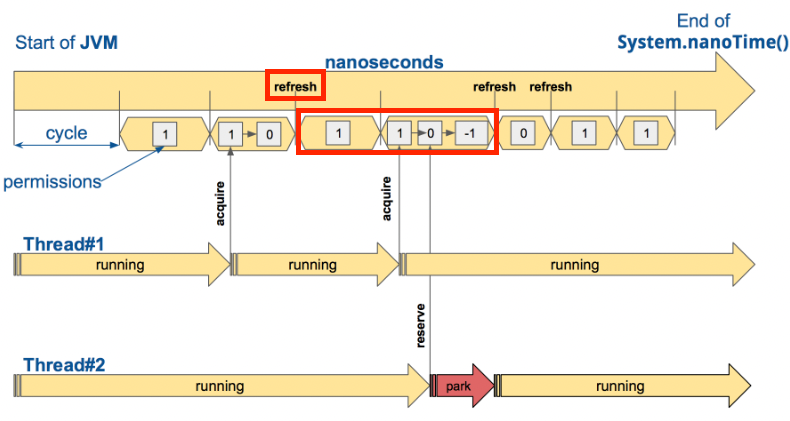

# Resilience4J

## 정의

- Netflix에서 개발하고 제공해줬던 Hystrix에서 염감을 받아서 Java8의 함수형 문법을 기반으로 제작한 fault tolerance 라이브러리 입니다

# Hystrix 와 Resilience4J

## 외부 라이브러리 참조 차이

- Hystrix는 외부 라이브러인 Guava 와 Apache Commons Configuration을 종속하고 있는 Archaius를 의존하고 있습니다
- 하지만 Resilience4J는 외부 라이브러리 종속 없는 [Vavr](https://www.vavr.io/)라는 것을 사용고 있습니다
    - cf) vavr: java를 위한 funcational 라이브러를 제공하는 오픈 소스입니다
- 현재 Hystrix는 더이상 관리되지 않기 때문에 Hystrix를 대체 하기 위해서 Resilience4J 를 사용하게 되었습니다
- 현재 Resilience4J는 계속해서 update가 되고 있습니다

## Fallback

```java
public class FallbackDecorators {
    public CheckedFunction0<Object> decorate(FallbackMethod fallbackMethod,
                                             CheckedFunction0<Object> supplier) {
        return get(fallbackMethod.getReturnType())
                .decorate(fallbackMethod, supplier); // supplier가 functional interface, biz logic
    } // resilience4J 내부에서는 모두 위임 형태로 가지고 있습니다. 그리고 fallback String값으로 획득한 method를 Fallback Decorator에 전달해서

    private FallbackDecorator get(Class<?> returnType) { // fallback 객체 검색
        return fallbackDecorators.stream().filter(it -> it.supports(returnType))
                .findFirst()
                .orElse(defaultFallbackDecorator);
    }
}

public class DefaultFallbackDecorator implements FallbackDecorator { // 검색된 fallback 객체

    @Override
    public boolean supports(Class<?> target) {
        return true;
    }

    @Override
    public CheckedFunction0<Object> decorate(FallbackMethod fallbackMethod,
                                             CheckedFunction0<Object> supplier) {
        return () -> {
            try {
                return supplier.apply(); // retry, bulk head, ratelimit, circuitbreaker
            } catch (IllegalReturnTypeException e) {
                throw e;
            } catch (Throwable throwable) {
                return fallbackMethod.fallback(throwable); // fallback method 호출
            }
        };
    }
}
```

- 모든 resilience4J는 `FallbackDecorators`를 가지고 있습니다.
- `FallbackDecorators`는 등록한 Fallback Method를 `FallbackDecorator`객체로 가지고 있습니다
- 그리고 `CheckedFunction0<Object> supplier` 는 functional interface를 통해서 circuitbreaker, bulkhead ..etc annotation이 선언된 method를 호출 합니다
- 마지막으로 에러가 발생할 경우 fallback decorator를 찾아서 fallback method를 호출하게 됩니다.

## Thread isolation(Hystrix)과 BulkHead(resilience4J)

### Hystrix 간단한 설명

1. Hystrix는 Thread Isolation semaphore 방식과 Thread pool방식이 존재합니다

- Thread Pool: caller Thread가 application thread를 낚아 채서 외부 API를 호출 하게 됩니다


- Semaphore 방식: API를 호출할 target Application에 한번에 동시에 호출 가능한 횟수를 semaphore형태로 가지고 있습니다.


- Semaphore방식은 thread pool과 달리 main application의 thread가 API를 호출하기 때문에 중간에 timeout이 발생할 경우 중간에 바로 멈추는 것이 불가능 합니다
- 하지만 thread pool은 외부의 thread를 호출 하기 때문에 timeout 이 발생하면 바로 중간에 main application thread를 return하면 됩니다. 결론적으로 timeout 시간을 명확하게 지켜야할 경우 thread pool을 사용하면 좋습니다

```java
public class AdapterForOuterServer {
    @HystrixCommand
    public String funOuterMethod() {
        // 외부 API 호출(rest api)
    }
}

public class AdapterForOuterServer extends HystrixCommand<String> {
    @Override
    protected String run() {
        // 외부 API 호출(rest api)
    }
}
```

### BulkHead(resilience4J)의 정의

- 격벽 패턴을 사용하고 있습니다 - 하단 격벽 패턴 참고
- 다른 서비스(Caller)에게 현재 서비스(Callee)의 자원을 제한해서 할당하는 기술 입니다
- 다른 서비스로 부터 API 호출이 되는 서버 Application(Callee)는 Connection Pool, Thread 수 와 같은 자원의 한계가 존재합니다
- 예를 들어서 A, B서비스는 C서비스를 호출 해야합니다. 그리고 A, B 는 C서비스를 7:3으로 호출 하고 있습니다. 그리고 B서비스가 A서비스 보다 C에 의존적입니다
- A 서비스에 사용자가 갑자기 몰려서 C서비스의 Thread pool을 많이 잡아 먹어 B서비스 사용자들이 time out exception이 많이 발생하는 이슈가 있을 수 있습니다
- 격벽 패턴은 A, B서비스에 대해서 한번에 C서비스를 호출할 수 있는 수량 및 범위를 제한 하므로서 A서비스가 C의 thread pool를 모두 잡아 먹는 것을 맊을 수 있으며
- B서비스 또한 다른 서비스로 인해서 C서비스를 이용 못하는 이슈를 방지하기 위해서 사용하는 것 입니다.
- resilience4J bulkhead 종류
    - SemaphoreBulkhead(Default)
    - FixedThreadPoolBulkhead

### SemaphoreBulkhead(Default) 특징

- semaphore 를 사용해서 동시에 실행 되는 횟수를 제한 합니다
- limit 횟수 이상으로 요청할 경우 Reject 시킴

### FixedThreadPoolBulkhead

- @BulkHead 를 method에 붙일 경우 `@Bulkhead(name = CIRCUIT_NAME, fallbackMethod = "bulkheadNotFoundFallback", type = Bulkhead.Type.THREADPOOL)` 와같이 type을 설정해야 합니다
- 고정된 thread pool과 bounded queue를 사용합니다
- thread pool을 사용, 만약 모든 thread pool이 사용될 경우 queue에 적제해서 대기 하게 됩니다
- 모든 thread pool이 사용중이며, queue가 꽉찰 경우 reject가 발생 합니다
- hystrix에서 제공하고 있는 isolation과 동일하다고 생각 하시면 됩니다

### BulkHead(resilience4J) 설정 팔일 및 AOP

1. AOP

```java

@Aspect
public class BulkheadAspect implements Ordered {
    // .. codes
    @Around(value = "matchAnnotatedClassOrMethod(bulkheadAnnotation)", argNames = "proceedingJoinPoint, bulkheadAnnotation")
    public Object bulkheadAroundAdvice(ProceedingJoinPoint proceedingJoinPoint,
                                       @Nullable Bulkhead bulkheadAnnotation) throws Throwable {
        Method method = ((MethodSignature) proceedingJoinPoint.getSignature()).getMethod();
        String methodName = method.getDeclaringClass().getName() + "#" + method.getName();
        if (bulkheadAnnotation == null) {  // @BulkHead 기 붙어 있는지 검사하는 곳
            bulkheadAnnotation = getBulkheadAnnotation(proceedingJoinPoint);
        }
        if (bulkheadAnnotation == null) { // annotation이 없을 경우 처리 flow
            return proceedingJoinPoint.proceed();
        }

        Class<?> returnType = method.getReturnType();
        String backend = spelResolver.resolve(method, proceedingJoinPoint.getArgs(), bulkheadAnnotation.name());
        String fallbackMethodValue = spelResolver.resolve(method, proceedingJoinPoint.getArgs(), bulkheadAnnotation.fallbackMethod());
        if (bulkheadAnnotation.type() == Bulkhead.Type.THREADPOOL) {
            /**
             * Thread Pool 방식으로 처리하는 곳
             */

            if (StringUtils.isEmpty(fallbackMethodValue)) {
                return proceedInThreadPoolBulkhead(proceedingJoinPoint, methodName, returnType,
                        backend);
            }
            return executeFallBack(proceedingJoinPoint, fallbackMethodValue, method,
                    () -> proceedInThreadPoolBulkhead(proceedingJoinPoint, methodName, returnType,
                            backend));
        } else {
            /**
             * semaphore 방식으로 처리 하는 곳 -> Default flow
             */
            io.github.resilience4j.bulkhead.Bulkhead bulkhead = getOrCreateBulkhead(methodName,
                    backend);
            if (StringUtils.isEmpty(fallbackMethodValue)) {
                return proceed(proceedingJoinPoint, methodName, bulkhead, returnType);
            }
            return executeFallBack(proceedingJoinPoint, fallbackMethodValue, method,
                    () -> proceed(proceedingJoinPoint, methodName, bulkhead, returnType));
        }

    }
}
```

- Flow
    - @Bulkhead 존재 유무 검사
    - Annotation 검사 후 callee method 호출
    - error 발생시 fallback 실행

2. 설정 파일

```
resilience4j:
  bulkhead:
    configs:
      default:
        max-concurrent-calls: 2
        max-wait-duration: 0
  thread-pool-bulkhead:
    configs:
      default:
        max-thread-pool-size: 2
        core-thread-pool-size: 2
        queue-capacity: 2
        keep-alive-duration: 20ms
```

- max-concurrent-calls
    - thread 최대 동시 호출 수
- max-wait-duration
    - 스레드를 차단할 최대 시간 -> 기본값은 0 입니다
    - default 0
    - bulkhead가 포화 상태일 때, 진입하려는 쓰레드를 블로킹할 최대 시간
    - 만약 max-concurrent-calls이 5, max-wait-duration 2초이고, 6개의 요청이 들어왔을 때, 5개의 Thread중 최소 1개 이상 2초 내로 끝나야지 6개 모두 처리 가능합니다
- core-thread-pool-size
    - ThreadPoolExecutor의 coreThreadPoolSize
    - default는 현재 PC의 core개수
- max-thread-pool-size
    - bulkhead thread 방식은 요청을 thread pool에 전달 합니다 이때 thread pool 사이즈를 설정합니다
    - ThreadPoolExecutor의 maxThreadPoolSize
- queue-capacity
    - max-thread-pool-size 를 초고하는 요청이 들어올 경우 queue에 적제해서 대기를 하게 되는데, 이때 queue의 사이즈를 나타 냅니다
- keep-alive-duration
    - ThreadPoolExecutor keep alive time을 의미 합니다
- cf) ThreadPoolExecutor
    - coreThreadPoolSize와 maxThreadPoolSize를 구분합니다
    - coreThreadPoolSize: 초기에 생성된 thread pool size
    - maxThreadPoolSize: coreThreadPoolSize 보다 더 많은 요청이 들어올 경우 추가로 최대로 생성가능한 thread pool size 입니다
    - 만약 요청이 많을때 maxThreadPoolSize만큼 Thread를 생성해서 keep a live time만큼 대기했다가, 추가 요청이 없음 coreThreadPoolSize개수 만큼 줄이게 됩니다

## RateLimit(resilience4J)

### RateLimit 정의

- 일정 시간동안 target application/method호출 요청 횟수를 제한하는데 기능을 의미 합니다
- AtomicRateLimiter와 SemaphoreRateLimiter 방식 2가지가 있고 AtomicRateLimiter가 default 입니다

```java
public interface RateLimit {
    // .. code
    static <T> CheckedFunction0<T> decorateCheckedSupplier(RateLimiter rateLimiter, int permits,
                                                           CheckedFunction0<T> supplier) {
        return () -> {
            waitForPermission(rateLimiter, permits); // limit-for-period 내부에 쓰레드 개수에 들기 위해서 권한을 획득하는 과정
            try {
                T result = supplier.apply(); // 사용자 api 호출 
                rateLimiter.onResult(result); // 결과 전달(자식 class 로직 실행)
                return result; // 결과 반환
            } catch (Exception exception) {
                rateLimiter.onError(exception);
                throw exception;
            }
        };
    }
    // .. code
}
```

### RateLimit 특징

- 클라이언트가 설정된 rate limit을 초과 한 경우 추가 요청을 거부하거나, 나중에 처리하거나(Queue 적제), 더 적은 양의 리소스를 할당할 수 있다
- client가 처음 rate limit이 걸려있는 code를 호출할 때 lazy하게 rate limit 객체가 생성됩니다
    - 만약 rate limit 객체를 바로 생성하고, rate limit이 에러 없이 처리되거나 실패가 났을때 event를 추가하고 싶을 경우 아래와 같이 설정할 수 있습니다
    - 그러면 `callRateLimit`에서 test RateLimit 객체가 생성되지 않고 `AnnotationBaseCircuitService` 객체가 생성될때 test RateLimit이 생성되게 되고, Evnet도 등록할 수 있습니다.

```kotlin
@Component
class AnnotationBaseCircuitService(
    private val callApiClient: CallApiClient,
    private val rateLimiterRegistry: RateLimiterRegistry,
) : ApiService {

    @PostConstruct
    private fun setUp() {
        rateLimiterRegistry.rateLimiter("test").eventPublisher
            .onSuccess { successEvent -> logger.info { "success: ${successEvent.rateLimiterName} ${successEvent.eventType}" } }
            .onFailure { failedEvent -> logger.info { "failed: ${failedEvent.rateLimiterName} ${failedEvent.eventType}" } }
    }

    @RateLimiter(name = "test", fallbackMethod = "rateLimiterFallback")
    fun callRateLimit(): String {
        return "1234"
    }

    private fun rateLimiterFallback(t: Throwable): String {
        return "handle"
    }
}
```

- 파라미터 종류
    - limit-for-period: 5
    - limit-refresh-period: 4s
    - timeout-duration: 10s
- 파라미터 해설:
    - 처음에 `limitForPeriod`에 설정된 갯수 만큼만 한번에 처리가 가능합니다
    - 그리고 처음 `limitForPeriod` 개수만큼의 thread 및 요청을 처리하게 됩니다.
    - 그리고 새로운 `limitForPeriod` 개수만큼의 thread를 처리하기 위해서 `limitRefreshPeriod` 만큼 기다려야 합니다
    - 하지만 현재 실행중인 thread는 `timeoutDuration`을 넘기면 안되기 때문에 `timeoutDuration`를 넘기게 되면 에러가 발생하게 됩니다
    - ex) 아래와 같이 설정될 경우 한번에 처리 가능한 요청 개수는 5개 입니다. 그리고 4초 간격으로 다음 5개의 요청을 처리합니다. 마지막으로 10초가 지난 요청들은 timeout을 띄웁니다
        - limit-for-period: 5
        - limit-refresh-period: 4s
        - timeout-duration: 10s

### AtomicRateLimiter

```java
public class AtomicRateLimiter implements RateLimiter {
    @Override
    public boolean acquirePermission(final int permits) {
        long timeoutInNanos = state.get().config.getTimeoutDuration().toNanos();
        State modifiedState = updateStateWithBackOff(permits, timeoutInNanos);
        boolean result = waitForPermissionIfNecessary(timeoutInNanos, modifiedState.nanosToWait);
        publishRateLimiterAcquisitionEvent(result, permits);
        return result;
    }

    private State updateStateWithBackOff(final int permits, final long timeoutInNanos) {
        AtomicRateLimiter.State prev;
        AtomicRateLimiter.State next;
        do {
            prev = state.get();
            next = calculateNextState(permits, timeoutInNanos, prev); // 다음 state 값을 생성
        } while (!compareAndSet(prev, next));
        return next;
    }
}
```

- RateLimiter가 생성된 시점부터 nanosec cycle단위로 나눕니다
- RateLimit에 API를 호출하게 되면 각 요청 별로 State값을 저장합니다 그리고 Cycle동안의 state 값은 불변 값을 유지 합니다
- 새로운 State가 생성되면 state값이 이전값과 차이가 있을 경우 `VarHandle` 의 `comparaAndSet(...)` native method를 통해서 atomic하게 변경을 해주게 됩니다.
    - 새로운 state를 통해서 일정 기간동안의 가용 가능한 thread개수 및 nano time정보를 확인할 수 있습니다
- State 파라미터
    - ActiveCycle: 마지막 호출에서 사용된 싸이클 번호(cycle 식별자)
    - ActivePermissions: 마지막 호출 후 가용된 허용 수 -> limit-for-period 을 기준으로 얼마나 더 호출 할 수 있는지 나타 냅니다
    - NanoToWait: 마지막 호출 후 허용을 기다릴 nano 시간
- ratelimit에서 refresh 시간(limit-refresh-period)동안 가용한 허용 수(limit-for-period) 보다 많이 적게 이용되고 있을 경우 refresh를 하지 않는 최적화 방식을 상용합니다
  
    - 위 사전에서 refresh부분의 앞 epoc(limit-refresh-period)을 보시면 permission(limit-for-period) 개수가 0개 이기때문에 다음 epoc에서 refresh를 진행합니다
    - 하지만 다음 epoc에서는 permission(limit-for-period) 개수가 1개가 남기 때문에 굳이 refresh를 하지 않고 다음 epoc으로 이전합니다
    - state를 계속해서 변경을 해주다 보면 성능 이슈가 발생하기 때문에 다음과 같이 변경어 없이 다음 epoc을 진행하고 있습니다

### SemaphoreRateLimiter

```java
public class SemaphoreBasedRateLimiter implements RateLimiter {
    public SemaphoreBasedRateLimiter(String name, RateLimiterConfig rateLimiterConfig,
                                     @Nullable ScheduledExecutorService scheduler, Map<String, String> tags) {

        this.scheduler = Option.of(scheduler).getOrElse(this::configureScheduler);

        this.semaphore = new Semaphore(this.rateLimiterConfig.get().getLimitForPeriod(), true); // 현재 clock cycle동안의 세마포어 개수 설정
        this.metrics = this.new SemaphoreBasedRateLimiterMetrics();

        scheduleLimitRefresh();
    }

    @Override
    public boolean acquirePermission(int permits) {
        try {
            boolean success = semaphore
                    .tryAcquire(permits, rateLimiterConfig.get().getTimeoutDuration().toNanos(),
                            TimeUnit.NANOSECONDS);
            publishRateLimiterAcquisitionEvent(success, permits);
            return success;
        } catch (InterruptedException e) {
            Thread.currentThread().interrupt();
            publishRateLimiterAcquisitionEvent(false, permits);
            return false;
        }
    }

    private void scheduleLimitRefresh() {
        scheduler.scheduleAtFixedRate(
                this::refreshLimit,
                this.rateLimiterConfig.get().getLimitRefreshPeriod().toNanos(),
                this.rateLimiterConfig.get().getLimitRefreshPeriod().toNanos(),
                TimeUnit.NANOSECONDS
        );
    }

    void refreshLimit() {
        int permissionsToRelease =
                this.rateLimiterConfig.get().getLimitForPeriod() - semaphore.availablePermits();
        semaphore.release(permissionsToRelease);
    }
}
```

- 처음 RateLimit 객체를 생성하게 되면 세마포어 정보 설정과 `scheduleLimitRefresh` method 호출해서 clock cycle동안 Demon Thread로 백그라운드로 동작 하게 됩니다.
- `scheduleLimitRefresh` method는 `limit-for-period` 간격으로 client thread가 할당 받은 semaphore를 다시 반환 받도록 해줍니다
- 사용자 Thread는 `acquirePermission` method에서 `tryAcquire` 통해서 세마포어를 획득 하게 됩니다.
- 그리고 `RateLimit` interface에 정의된 `decorateCheckedSupplier` method를 통해 개발자가 작성한 비즈니스 로직호출해 처리하게 됩니다

## RateLimiter VS BulkHead

- BulkHead: 한번에 동시에 처리할 수 있는 요청 횟수를 제한합니다 -> 5개의 요청이 한번에 가능
- RateLimit: 일정 기간동안 처리가능한 요청 횟수 제한을 설정 하는 것 입니다 -> 매 2초 동안 5개의 요청 처리 가능

## 부록

### [BulkHead Pattern](https://www.vinsguru.com/bulkhead-pattern/)

1. 참고 링크 [추가 링크](https://docs.microsoft.com/ko-kr/azure/architecture/patterns/bulkhead)

2. 정의

- 애플리케이션을 풀로 격리되므로 실패하는 경우 다른 요소가 계속 작동할 수 있도록 방지해주는 패턴 입니다.
- service의 독립적인 scale을 설정할 때 사용

3. 문제점

- Cloud 환경에서는 한개의 애플리케이션은 여러 서비스로 분할 해서 사용하게 됩니다. 그리고 애플리케이션은 한번에 여러 서비스에 요청을 보낼 수 있습니다.
- 하지만 하나의 서비스에서 에러가 발생할 경우 retry를 보내는 과정과 에러 처리 과정에서 connection을 계속 맺고있기 때문에 리소스 사용이 계속 되고 있습니다
- 그러므로 오직 한 곳에서 에러가 발생하게 되면 다른 서비스의 리소스를 계속 점유하고 있기 때문에 영향이 갈 수 밖에 없는 문제가 발생합니다

4. 해결 방법

- 서비스 별로 소비자의 부하를 예상해서 서비스 별로 scale out을 설정 합니다
- database와 같이 각 서비스가 각각 따로 분리해서 사용할 수 있는 자원일 경우 분리해서 자원을 사용하는 것도 하나의 방법입니다

5. Spring Cloud BulkHead Pattern

- circuit breaker또한 BulkHead Pattern을 일부분을 상요하고 있습니다
- 각 서비스 간의 의존성이 존재합니다, 예를 들어서 A service 는 B service의 API를 호출할 경우 A는 B서비스를 의존하고 있습니다
- 하지만 B서비스의 API는 A service 말고 C,D,E서비스 에게도 API를 제공하고 있습니다
- 위와 같이 여러 의존성이 발생할 수 있으므로 Thread pool 개수와, Semaphore 개수를 각 서비스 마다 할당해서 한 곳에서 독점적으로 자원을 사용하지 않도록 방지 하는 형태를 가지고 있습니다.

## Retry

### 정의

- 처음 API를 호출 후 네트워크 이상과 같은 실패가 났을때 재시도하는 역할을 하는 기능 입니다
- 재시도 횟수와 간격을 지정할 수 있는 것 입니다

### 매게변수 정의

- max-retry-attempts(max-attempts): 재시도 횟수
- wait-duration: 재시도 하기 위해서 다기 시간(간격)
- retry-exception: 재시도를 할 수 있는 예외 에러 케이스

### Retry 예시와 코드 설명

```kotlin
class TestService {
    @Retry(name = "retry-test", fallbackMethod = "retryFallback")
    fun callRetry(): String {
        logger.info("retry")
        throw Exception("exp")
        return "retry"
    }

    private fun retryFallback(t: Throwable): String {
        return "retry fallback"
    }
}
```

- @Retry 에서 name설정과 fallback을 진행합니다
- 최대 max-attempts 횟수까지만 retry가 가능 하고 그 후에는 fallback으로 처리 합니다

```java
public interface Retry {
    // ... codes
    static <T> CheckedFunction0<T> decorateCheckedSupplier(Retry retry,
                                                           CheckedFunction0<T> supplier) {
        return () -> {
            Retry.Context<T> context = retry.context();
            do {
                try {
                    T result = supplier.apply(); // 사용자가 정의한 비즈니스 로직
                    final boolean validationOfResult = context.onResult(result);
                    if (!validationOfResult) {
                        context.onComplete();
                        return result;
                    }
                } catch (Exception exception) {
                    context.onError(exception);
                }
            } while (true);
        };
    }
    // ... codes
}
```

- retry 로직은 위와 같이 do while 형태로 진행하며
- context(RetryImpl.class)에서 onError에서 retry 횟수보다 아래일 경우 exception을 띄우지 않고 만약 retry 횟수를 넘길 경우 exception을 띄우게 됩니다
- exception이 발생하게 되면 fallback이 호출 됩니다


## 참고자료

- https://sabarada.tistory.com/206
- https://dlsrb6342.github.io/2019/06/03/Resilience4j%EB%9E%80/
- https://resilience4j.readme.io/docs
- https://docs.spring.io/spring-cloud-circuitbreaker/docs/current/reference/html/
- https://github.com/Netflix/Hystrix/wiki/How-it-Works
- https://godekdls.github.io/Resilience4j/latelimiter/
