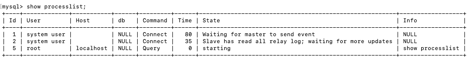

## Replica 복제 지연 문제

### 복제 지연 발생 이슈

- 원인: Amazon RDS for MySQL은 비동기 복제를 사용하기 때문에 일부 DB 변경 사항이 반영되지 않는 경우가 있습니다
- seconds_behind_master: master DB와 slave DB사이에 현재 타임스탬프 간의 차이가 표시하는 것입니다

### MySQL 복제를 위한 Thread
- master


- slave


- cf)`SHOW PROCESSLIST` 명령어를 통해서 내부 process list를 볼 수 있습니다

1. Binlog Dump Thread
- replica에 binary log 정보를 전송하는 역할을 담당합니다
- 현재 master process list 사진에서 ID 7에 해당합니다

2. Replica IO Thread
- `start slave` query가 slave DB에 들어가게되면 생성되는 thread 입니다
- 해당 Thread는 master DB의 Binlog Dump Thread로 부터 전송된 binary log를 수신 받아서 log 파일에 작성하는 역할을 담당합니다

3. Replication SQL thread
- log에 작성된 SQL를 실행하는 thread 입니다


## 해결 방법

### Mysql Worker 생성

1. 정의
- replica를 설정하게 되면 default로 각 1개 Binlog Dump thread와 replica IO thread, SQL thred나 생성됩니다
- 단일 쓰레드기 때문에 master의 많은 요청을 slave로 이전하는 과정에서 이슈 발생할 수 있습니다

2. 해결 법
- slave_parallel_workers 설정
- SQL thread가 직접 sql문을 실행하지 않고 worker들에게 일을 할당하는 방식을 사용합니다(이렇게 서로 상호적으로 업무를 처리하기 때문에 공식 문서에서는 Coordinator라고 표현 합니다)
- default 가 0인 것을 변경
- worker수가 여러개일 경우 복제 SQL 1개의 trasaction 실행이 완료되기 전에 연속적으로 transaction을 처리할 수 있습니다
- 여러 thread끼리 경합 이슈가 존재할 수 있기 때문에 순서를 고려해야합니다 그러므로  LOGICAL_CLOCK

```
STOP SLAVE;
SET GLOBAL slave_parallel_type='LOGICAL_CLOCK';
SET GLOBAL slave_parallel_worker=8;
START SLAVE;
```

### MTS(Multi Threaded Slave)

1. Database 방식

- 과거 Mysql 5.6 이하 버전에서 사용하는 병렬 복제 방식 입니다
- schema 단위로 개별적인 복제 처리를 진행
- schema 단위로 worker thread가 개별로 생성됩니다
- schema 당 1개의 worker thread만 생성된다면 worker thread를 생성한 장점이 없어집니다
- tranasaction을 고려하지 않고 반영하기 때문에 각 schema가 독립적인 구조가 아니라 트랜잭션으로 묶여서 사용되는 환경에서는 Master-Slave 간 데이터 정합성을 보장할 수 없다.
- 한쪽 schema에서 지연이 일어나면 전체 database에도 지연 발생
  - db에 유입되는 부하가 균일해야하며, 짧은 쿼리위주로 실행해야 합니다

2. LOGICAL_CLOCK 방식

- Mysql 5.7 이상 부터 사용가능한 병렬 처리 방식입니다
- slave_parallel_type, slave_preserve_commit_order 옵션 추가
  - slave_parallel_type: DATABSE와 LOGICAL_CLOCK중 어떤 방식을 사용할지 결정하는 것 
  - slave_preserve_commit_order: replica서버에서 이벤트들이 master 서버에서 commit 순서와 동일한 순서로 commit 할 것인지를 제어하는 시스템 변수
    - ON(1), Off(0)
- Master의 Binlog Group Commit 단위로 동시 수행 여부 가능한 것을 판단해서 처리하도록 변경되었습니다
- DATABASE 기법에서는 한 schema당 worker를 개별로 설정하여서 한 schema의 worker들이 모두 SQL처리를 하고 있게되면 다른 schema worker들이 아무 일도 하지 않더라도 사용할 수 없었습니다 하지만 master binlog group commit 단위로 worker가 처리 하고, Schema 단위로 worker가 할당되어 있지 않기 때문에 해당 앞에 언급한 이슈가 해겨이 됩니다.
- master에서 prepare commit timestamp 기준으로 relay log 이벤트들을 worker thread에 할당합니다
- binlog group commit단위로 처리 worker가 업무를 처리하기 때문에 commit 순서가 달라질 수 있습니다 이문제를 해결하기 위해서 seq_number정보를 사용해서 순서를 보장하게 된니다

cf) 
- GTID(Global Transaction identifier): Mysql DB에서 commit 되는 각 transaction과 함께 생성되고 trnasaction에 연결되는 고유한 식별자 입니다

```
gtid-mode=1(ON) # mysql 8.0.26 버전 부터 가능
enforce_gtid_consistency=1(ON)
set global slave_parallel_type=LOGICAL_CLOCK;
set global slave_parallel_workers=4;
set global slave_preserve_commit_order=1;
```

cf) `slave_preserve_commit_order`를 1로 변경하고 싶을경우 `log-bin`, `log-slave-updates` 를 모두 enable해줘야합니다
- log-bin: db의 이진로그를 저장할지 여부를 선택하는 것입니다. 
- log-slave-updates: slave relay log를 디스크에 저장하는 옵션입니다. log-bin를 enable해줘야지 합니다

### Long Query

- 만약 master db에서 1시간 소요되는 query를 실행할 경우 slave에서도 동일하게 1시간 소요되게 됩니다
- 겨론적으로 2시간이라는 gap이발생하게 됩니다.
- 해당 문제는 long query 성능 개선으로 해결할 수 있습니다

### DB 인스턴스 크기 및 스토리지 부족
- 리소스가 부족해서 복제본이 제한될 수 있습니다
- 복제본의 스토리지가 꽉찰 경우 더이상 변경사항을 반영할 수 없습니다

### replica DB인스턴스 디스크 동기화된 이진 로그
- sync_binlog 값이 1일 경우 이진 로그 정보가 master와 replcae node의 bin log간의 동기화가 되게 됩니다
- 처음에 N개의 query 이진 로그를 저장하고 sync_binlog를 실행해 로그 정보의 무결성을 유지하려고합니다
- replica node의 OS나 장비 장애가 발생할 경우 bin log불이리치 이슈가 생길 수 있는데 이문제를 해결할 수 있습니다 하지만 동기화 과정에서 성능상의 문제가 발생합니다

### Binlog_format 설정
- 단순 Insert/Update/Delete 에서는 Bin Log를 저장 방식을 의미 합니다
- 종류 
  - Statement Format: data 변경에서 사용되는 모든 query를 쿼리대로 저장하는 방식
  - Row Format: 변경 작업으로 변경된 모든 ROW의 정보를 기록(항상 PK를 사용해서 행을 효과적으로 식별할 때 유리합니다), 결과값을 바로 log에 저장하는 것
  - Mixed Format: statement방식과 row 방식을 혼합한 방식으로서 기본적으로는 statement방식을 상요하지만 특정 상황에서 row방식을 사용합니다
- Row Format으로 설정할 경우 Mater에 PK를 설정하지 않을 경우 문제가 발생합니다
- PK가 설정되어 있지 않을 경우 slave_rows_search_algorithms 파라미터로 인해서 Table 전체 스캔을 하게 됩니다
- 그러므로 이문제를 해결 하기 위해서 slave_rows_search_algorithms를 TABLE_SCAN,INDEX_SCAN => INDEX_SCAN, HAS_SCAN으로 변경해야 합니다
- 그리고 이런 경우 무조건 PK를 설정하는 것을 권장 합니다

### 참고 자료
https://dev.mysql.com/doc/refman/5.6/en/replication-implementation-details.html
https://hoing.io/archives/3939