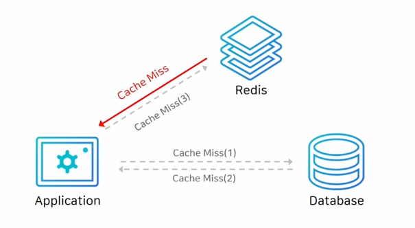
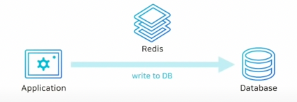
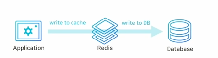

# Index

1. Redis 캐시로 사용하기
2. Redis에서 데이터를 영구적으로 저장방법(RDB, AOP)
3. Redis 아키텍쳐
4. Redis 운영과 장애 포인트

# 1. Redis 캐시로 사용하기

## 1.1 Redis 사용처
- 캐싱 솔루션
- 캐시 : 사용자의 데이터를 더 빠르게 조회할 수 있는 데이터 저장소

## 1.2 Redis 특징
- 단순한 Key-value 구조
- in memory 데이터 저장소 -> 속도가 빠름
- 빠른 성능을 가짐

## 1.3 캐싱 전략
### 읽기 전략(Look-Aside Lazying Loading)
1. 구조

- 처음에 application이 redis부터 검색
- redis에 해당 데이터가 없을 경우(miss) DB로 접근해서 데이터 fetch
- redis에 다시 저장 후 반

2. 장점
- redis가 다운되더라도 DB로 부터 데이터를 가져올 수 있기 때문에 장애 요소를 없앨 수 있음

3. 단점
- 모든 connection이 DB로 붙을 수 있기때문에 성능 문제가 발생할 수 있음
- 처음에 캐시 미스 많이 발생할 수 있음

4. 해결법
- cache warming: 미리 캐시에 데이터를 밀어 넣어주는 작업을 진행

### 쓰기 전략(Write Around)
1. 구조

- DB에 모든 데이터 저장
- 캐시 미스가 발생 -> DB 에서 데이터를 가져와서 캐시에 저장

2. 단점
- 캐시랑 DB랑 데이터가 다른 이슈 발생할 수 있음

### 쓰기 전략(Write-Through)

1. 구조

- write할 때 무조건 캐시에 저장 후 DB에 저장

3. 장점
- 캐시는 무조건 최신정보를 가짐

4. 단점
- 저장 단계가 2단계이기 때문에 성능 저하 발생
- 재사용하지 않는 데이터도 캐시에 저장하므로 성능 저하 및 메모리 leak 발생 가능성 존재 -> 해결 법 expire time 설정이 필요

# 2. Redis 영구 저장(AOF, RDB)

## 2.1 Redis Persistence

- Redis는 in-memory 데이터 스토어
- 서버 재시작 시 모든 데이터 유실
- 복제 기능을 사용해도 사람의 실수로 발생 시 데이터 복원 불가
- Redis를 캐시 이외의 용도로 사용한다면 적절한 데이터 백업이 필요

## 2.2 Redis Persistence Option

### AOF
- Append Only File의 약자로서 데이터 변경하는 command가 들어오면 command를 모두 저장
- 데이터가 많이 커지게됨 -> 주기적으로 압축이 필요함
- redis.conf파일에서 auto-aof-rewrite-percentage옵션(크기 기준)을 기준으로 자동으로 AOF로 저장된 데이터를 압축할 수 있음
- BGREWRITEAOF command를 이용해서 CLI창에서 수동으로 AOF 파일 재작성 가능

### RDB
- 데이터를 snapshot을 사용하듯이 redis상태를 저장함
- redis.conf 파일에서 SAVE 옵션을 사용해서 자동으로 저잘하게할 수 있음 -> 시간단위로 저장 가능
- BGSAVE command를 이용해서 cli 창에서 수동으로 RDB 파일 저장
  - save command 절대 사용 하면 안됨

### 선택
- 캐시로만 redis 사용: 사용할 필요없음
- 어느정도 데이터 손실 감소 가능: RDB만 사용 -> redis.conf에서 save옵션을 잘 사용해야함
- 장애 시점까지 모든 데이터를 복구해야하는 경우 : AOF 사용하기 -> everysec를 사용해서 1초단위로 저장해서 성능 개선을 해야함 -> 최대 1초 정도의 분실 될 수 있음

# 3. Redis 아키 텍쳐

## 3.1 Replication 구성
### 정의
- 단순이 복제된 redis만 존재
- 비동기식으로 복제 -> 복제본된 데이터를 전달하고 기다리거나 확인하지 않음
- HA 기능 없음
  - 장애 상황시 수동으로 복구 해야함 
  - replicaof no one -> 복제를 먼저 끊어야함
  - 애플리케이션에서 연결 정보 변경이 필요

## 3.2 Sentinel 구성

### 정의
- sentinel node까지 추가 및 sentinel node가 redis를 감시
- 마스터가 비정상 상태일 경우 자동으로 fail over를 시켜줌
- applciation/redis에서 연결 정보 변경 필요 없기 때문에 편리함
- sentinel node는 항상 3대 이상 홀수로 필요
  - 과반수 이상 failover를 해야한다고 동의해야지 failover를 진행하기 때문

## 3.3 Cluster 구성

### 정의
- 키를 여러 노드에 자동으로 분할해서 저장하는 샤딩 기능 제공
- 모든 노드가 서로를 감시하며, 마스터가 비정상 상태일 때 자동으로 failover를 시켜줌
- 최소 3대의 mater node가 필요

# 4. Redis 운영 장애 요소

## 4.1 상요사면 안되는 command
- redis 는 single thread이기 때문에 수행하는데 오래결리는 command입력시 모든 요청이 block되는 이슈 발생

### Command
- keys * (모든 키 조회) -> scan 0 으로 대체해야함: 재귀적으로 key들을 하나씩 호출
- Hash나 sorted set 자료구조 -> 내부에 데이터가 많아질수록 성능이 저하가되는 이슈 발생
  - 최대 100만개 이상 넘어가지 않도록 조절해야함 -> 키를 나누는 방식을 고려해야함
  - hgetall -> hsacn
  - del -> unlink: 많은데이터가 존재할 경우 key를 지울동알 모든 것이 block -> unlink는 background에서 지워주기 때문에 성능 개선

## 4.2 기본 설정값으로 성능 개선

### STOP-WRITE-ON-BGSAVE-ERROR = NO
- yes(default)
- yes일 경우 RDB 파일 저장실패시 redis로 들어오는 모든 write을 차단해주는 것

### MAXMEMORY-POLICY = ALLKEYS-LRU
- redis 캐시를 사용할때 expire time설정을 권장하지만, 이럼에도 불구하고 꽉찬 경우가 있음
- memory에 모든 데이터가 꽉찬경우 MAXMEMORY-POLICY 정책에 의해서 key 관리
  - noeviction(defulat): 삭제 하지 않음 -> 새로운키 저장 거부 -> 장애가 될 수 있음
  - volatile-lru: lru 정책을 사용하지만 expire time이 설정된 key만 삭제하는 뜻으로 모든 key가 expire time이 없을 경우 장애가 될 수 있음
  - allkeys-lru: 모든 key에 대해서 lru 가능

### Cache Stampede 이슈
1. 정의
- TTL이 너무작을 경우 모든 Application 서버들이 DB에 동시에 데이터를 읽어서 동일한 데이터를 redis에 저장하는 이슈 발생
- Duplicated read/duplicated write 이슈 발셍

2. 해결 방법
- TTL 시간을 넉넉하게 늘리는 방식을 문제를 해결

### MaxMemory 값 설정
- persistence / 복제 사용시 MaxMemory 설정 주의
- RDB나 AOF를 사용할 때 fork로 자식 프로세스를 생성해서 backgrond에서 데이터를 파일로 저장하게 됩니다
- 그리고 원래 process는 redis 요청 데이터를 처리함
- 이유: copy on write 를 사용해서 memory를 복사해서 사용함
  - COW: 처음에 두 프로세스가 동일한 메모리 영역을 공유해서 사용합니다. 그리고 redis의 main process가 수정을 할경우 새로운 메모리 영역에 카피를 해서 데이터를 저장하고 참조하는 방식을 의미 합니다.
  - 서버의 메모리 사용률이 2배로 증가하는 이슈가 발생함
  - 복제를 처음 시도하거나, 연결이 끊겼다가 재시도를 할 경우 새로 RDB파일을 저장하는 과정을 거치게 되어서 메모리 사용률 2배까지 증가할 수 있음
- max memory를 실제 memory의 1/2로 설정이 필요

### used_memory_rss 값을 보기
- used_memeory: 논리적으로 redis 가사용하는 메모리
- used_memroy_rss: OS가 redis에 할당하기 위해 사용한 물리적 메모리 양을 보여줌
- used_memory_rss와 used_memory와의 차이가 클 경우 fragmentation이 크다고 말을 합니다
- 삭제되는 키가 많으면 fragmentataion 증가
  - 특정 시점에 피크를 찍고 다시 삭제되는 경우
  - TTL로 인해 삭제가 과도하게 많이 발생하는 경우
- CONFIG SET activate frag yes 를 잠시 켜두어서 fragmentation을 해결하는게 좋음 -> 공식문서에서는 항상켜두지 말고 잠시 켜뒀다가 끄는게 좋다고 나와있음

# redis 데이터 분산

## Application 레벨 분산

### Consistent Hashing

1. 정의 
- key값을 해시를 해서 자기 값보다 크지만 가장 가까운 서버로 가는 방식을 의미합니다
- modular를 사용할 경우 서버가 추가 및 다운될 경우 많은 reblancing이 발생함
- redis 자체적으로 제공하지 않기 때문에 무조건 Application 단위에서 처리해야합니다

2. 장점
- 일반 mod한 값보다 rebalancing 양이 줄어들어서 좀 더 효율적
- 서버가 죽거을 경우 해당 죽은 서버의 key값만 rebalancing하면 됨
- 서버가 추가될 경우 그 redis hash값 보다 작은 redis에만 영향이 가게 됩니다
- 1/n만큼의 reblancing이 이뤄짐

## Cluster

### 목적
- 데이터 셋을 여러 노드로 자동 분할하는 기능을 제공합니다
- 최대 1000대까지 노드로 확장할 수 있도록 하기 위해서 사용하는 것
- 최소 3대의 master node가 필요합니다
- 노드 추가, 삭제시 레드스 클러스터 전체를 중지할 필요 없이, key 이동시에만 해당 키에 대해서만 잠시 멈출 수 있습니다
- 일부 마스터 노드에서 장애가 날경우 일정 부분은 정상 동작하게 사용할 수 있음, 하지만 대부분 master node가 죽으면 중지됨

### 특징

- mater node가 다운될 경우 replica 노드를 승격 시켜주는 기능을 제공
- fullmash로 모두 연결되어 있기때문에 노드끼리 서로 fail을 감
- 만약 자원이 좀 여유가 있을 경우 아무 마스터를 replica하는 노드를 추가 하면 좋습니다
  - 만약 1개의 master노드가 죽으면 여유분 replica node가 죽은 node의 replica가 되어서 죽은 Matser가 다시 살아 날 때까지 안정성을 보장해줄 수 있음
- 모든 cluster node는 2개의 TCP통신이 이뤄짐
  - 6379, 16379번을 주로 사용
  - 16379번 포트는 바이너리 프로토콜을 사용하며, 노드간 통신 채널인 클러스터 버스에 사용됩니다
  - 노든간 장애 감지, 구성 update, failover 권한 부여등을 이 port에서 이뤄집니다
- 강력한 일관성을 보장하지 않음(데이터 유실할 수 있음)
  - 비동기 복제를 사용하기 때문(client -> Mater Redis 요청 -> client ACK -> replica진행)
    - 진연시간이 증가되는걸 꺼려해서 이렇게 처리 
  - redis network 통신이 끊긴 경우
    - A,B,C,(A1,B1,C1: replica) redis 가 존재할 경우 client 가 B node에 데이터전달 과정에서 B Node와 A,C,(A1,B1,C1) node들과 통신 이끊긴 경우 Node B에 전달된 데이터 만큼 누락이 발생할 수 있음

### Hash Slot 방식

1. 정의
- redis는 slot 단위로 나눠서 처리 하는 샤딩 방식입니다
- redis 자체적으로 제공하는 기술입니다
- 16384개의 slot이 cluster 내부의 master redis에 분배됩니다
- 최대 16384개의 클러스터를 생성할 수 있지만 최대 1000개까지 권장을 합니다
- HashSlot = CRC16(key) mod 16384 으로 계산 합니다

2. 특징
- 다운탐이 없이 자유롭게 slot이동 가능
- 새로운 노드 추가/삭제시 hash slot만 이도하면 되기 때문에 쉽게 scale up down할 수있음
- 기본적으로는 multiple key를 사용할 수 없습니다 하지만 동일한 slot에 대헛 multiple key를 사용할 수 있습니다
 
### Redis cluster 제한 사항

- 멀티 키 명령어를 수행할 수 없음
  - ex) MSET key1 value1 key2 value2, SUNION key1 key2, SORT
- hash tag를 사용하면 multi key  명령어 사용 가능
  - {}로 감싸는 것을 의미
  - {user001}.following과, {user001}.followers는 같은 슬롯에 저장

## Redis Failover

### Coordinator 기반
- Zookeeper, etcd, consul 등 Coordinator 사용
- health checker가 redis의 health cheking을 하고 있을때 계속 확인하게 됩니다
- 그리고 master가 장애가나면 health checker coordinator에 알려주고, coordinator가 API server에 current redis ip주소를 전달하는 형태
- 특정 언어들은 coordinator를 지원하지 않을 수 있음

### VIP/DSN 방법
- virtual ip 주소를 설정
- 새로운 VIP를 설정해서 사용, health checker가 vip의 real ip로 변경해줍니다
- 클라이언트에 추가적인 구현이 없어서 좋음
- DNS의 real ip를 캐싱을 할 수 있음
  - java인경우 30초로 되어있지만 나중에 무한데일 경우 큰 장애로 될 수 있음
  - DNS 캐시 TTL 지정이 필요
- AWS는 DNS을 사용
- VIP가 더 안정적임

### 모니터링
- redis info를 통해서 정보 얻을 수 있는게 있음
  - rss: 물리 메모리를 얼마나 사용하는지 확인 가능
  - connection 수: redis connection이 치솟았다가 끊어진 경우가 발생할 수 있음
  - 초당 처리 요청수
- system
  - CPU
  - DISK
  - Network 정보: 스위치 packet drop이 발생할 수 있기때문에 대역폭을 많이 사용 될경우 있음