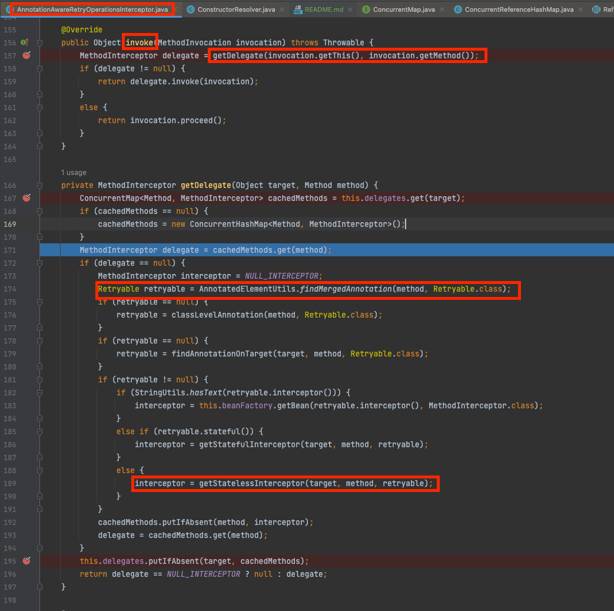

# 1. Retry

## 1.1 Retry

### 1.1.1 정의

- 일부 exception이 발생시 다시 재시도 하는 오픈소스 라이브러리 입니다
- `@Retryable`를 붙이면 AOP 기반으로 동작

## 1.2 Retry 사용 법

## 1.3 Retryable의 옵션들

# 2. Retry 내부 구조

## 2.1 Retry 설정과 적용

### 2.1.1 AOP 적용

1. AOP 적용 방식

```java
public class AnnotationAwareRetryOperationsInterceptor implements IntroductionInterceptor, BeanFactoryAware {
    //.. codes
}
```

- `AnnotationAwareRetryOperationsInterceptor`는 `IntroductionInterceptor` interface를 구현한 클래스 입니다.
- `IntroductionInterceptor` interface는 `MethodInterceptor`(`Advice`를 상속받은 interface)를 상속받는 interface 입니다.
- 결론적으로 `IntroductionInterceptor` interface는 AOP를 적용할 때 Advice를 담당하게 됩니다.
- `MethodInterceptor` interface는 `Object invoke(MethodInvocation invocation) throws Throwable` method를 통해서 추가 기능(@Around 와 동일)을 정의 할 수 있습니다.
- `invoke` method를 통해서 retry 로직을 추가한 Advice는 `RetryConfiguration` class를 통해서 생성되고, Bean으로 등록이 됩니다.
- 우리는 위 내용을 통해서 `@Retryable` 붙은 method를 호출할 경우 `AnnotationAwareRetryOperationsInterceptor`에 정의된 invoke 함수를 호출하는 것을 알게 되었습니다.



- 현재 위 사진을 보면 `invoke` method가 호출 되면 `getDelegate` method를 호출 합니다.

[//]: # (- `@Retryable` annotation은 한 곳에 설정되는 것이 아니라 여러 곳에 선언하게 됩니다. 결론적으로 하나의 method에 여러개의 @Retryable이 붙게 되면)

- `AnnotationAwareRetryOperationsInterceptor` class 내부에서는 retry 횟수와 같은 옵션 정보를 담고있는 `@Retryable`을 가져오고 있습니다.
- 가져온 `getStatelessInterceptor` 라는 method를 호출 합니다.

```java
class AnnotationAwareRetryOperationsInterceptor implements IntroductionInterceptor, BeanFactoryAware {

    // codes...

    private MethodInterceptor getStatelessInterceptor(Object target, Method method, Retryable retryable) {
        RetryTemplate template = createTemplate(retryable.listeners());
        template.setRetryPolicy(getRetryPolicy(retryable));
        template.setBackOffPolicy(getBackoffPolicy(retryable.backoff()));
        return RetryInterceptorBuilder.stateless().retryOperations(template).label(retryable.label())
                .recoverer(getRecoverer(target, method)).build();
    }

    // codes...

}
```

- `getStatelessInterceptor` method는 `@Retryable`에 정의된 옵션들을 `RetryPolicy`, `BackOffPolicy` 라는 객체에 넣어서 정의 합니다.
- 그리고 exception 발생시 실제 retry를 진행하는 `RetryTemplate` class를 생성하고 `RetryPolicy`, `BackOffPolicy`를 주입 해줍니다.

## 2.2 RetryTemplate

### 2.2.1 정의

- `RetryTemplate`는 주입받은 `RetryPolicy`, `BackOffPolicy` 객체를 통해서 실제 retry 로직을 실행하는 class 입니다.