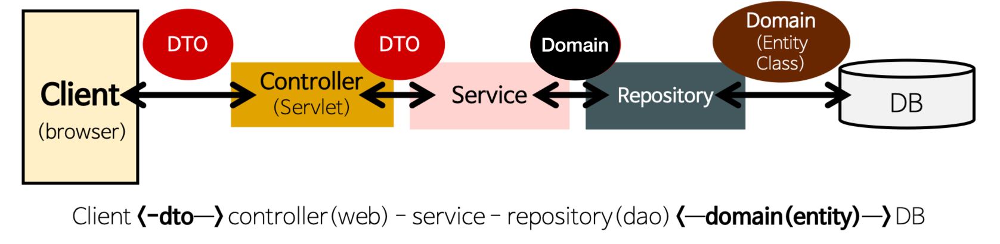
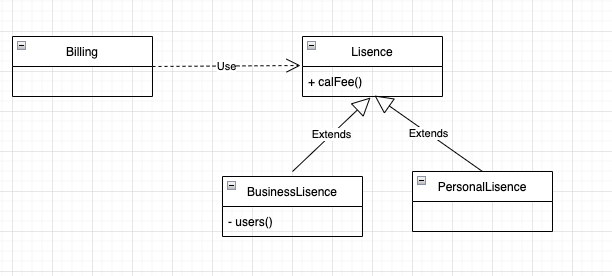
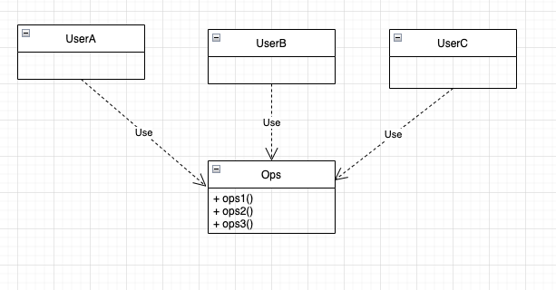
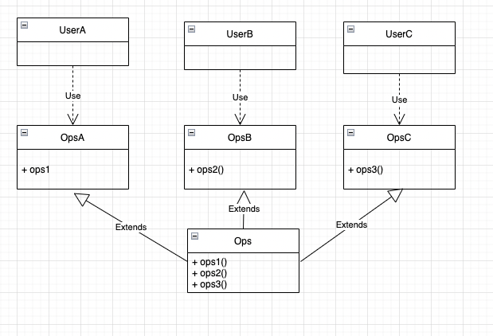

> 필자는 암묵적으로 지켜오려고 노력했던 SOLID원칙에 대해서 명확하게 하기 위해서 학습을 진행했습니다. 

## 1. S(단일 책임 원칙)
### 정의
- 1개의 모듈은 하나의 Actor를 책임 진다는 뜻 입니다
- 모듈: 함수와 데이터구조로 이뤄진 하나의 응집체 입니다
- Actor: 시스템/모듈을 사용자 및 이해관계자 입니다
- 하나의 역할을 해야하는건 Method이지 Class는 하나의 역할을 하게 되면 복잡성과 관리에 문제가 될 수 있다

### 다중 Actor 예시

- Employee라는 Entity 객체가 있습니다
- 추가 비즈니스 로직
  - 급여 징수 로직: 회계
  - Entity 저장 로직(DB): 일반 DB저장
  - 업무 진행시간 report 기능: 인사
- 위의 3가지 요구사항은 모두 회계, 인사, 일반으로 총 3개의 Actor를 가지게 됩니다

### 다중Actor 문제점
- 급여 징수와 함수가 업무 진행시간 report함수를 상요할 경우 인사 Actor에 결합도가 높아기게 됩니다
- 만약 급여 징수 함수에서 공휴일 업무시간에 대해서 시간을 1.5배로 계산한다고 가정한다면 인사쪽 API에 큰 영향이 가게 되는 이슈가 발생합니다

### Git병합 이슈
- 개발자가는 하나의 feature에 대해서개발을 진행하고 git으로 코드 통합을 하게 됩니다
- 이때 2개의 Actor에 의해서 추가 요구사항을 구현할 경우 Employee라는 같은 class를 수정을 하게 됩니다
- 코드 통합시 충돌 문제발생 -> 충돌을 해결하기위해서 merge를 하지만 merge과정에서 에러 발생가능성존재

### 해결법

- Actor별로 Class분리
- 회계, 인사 관련 Service Class를 생성하고 Entity 저장에 필수적인 함수는 Employee class유제 합니다

## 2. O(개방 폐쇄 원칙)
### 정의
- 확장에 열려있고, 변경에 닫혀 있다는 뜻입니다
- 추가 요구사항과 수정이 이뤄져야할 경우 기존 코드에 수정을 최소화 하고, 하나의 class에 코드 추가 만 해서 기능을 완성시킬 수 있는 아키텍쳐 구조를 의미 합니다.

### 계층구조와 방향성
- Spring 프로젝트에서 보면 MVC Pattern을 기본으로 하고
- Controller를 또 Presentataion layer구조, 그리고 Model을 Service, Repository로 분류 한걸 확인할 수 있습니다

- Client는 Controller를, Controller는 Service를, 그리고 Service는 Repository를 찹조하고 있습니다
- 하지만 반대는 성립하지 않습니다
- 이렇게 layer구조를 설정하는 이유는 
- Controller, Client가 변경이 이뤄진다고 했을때 Service, repository는 변경에 대해서 영향을 받지 않게 하기위 해서 입니다
- 만약 repository가 수정이 이뤄진다면 Entity class를 공유하는 Service layer가 영향을 받아서 변경이 이뤄집니다 
- DTO라는 data class를 통해서 Service와 controller와 소통을 하기 때문에 DTO class로 인해서 Controller에 영향이 가지 않습니다
- 위와 같이 영향이 가지 않도록 분리를 하고 차단을 하는 것이 하나의 개방 퍠쇄 원칙의 하나의 원리 입니다

### 추가설명
- 개발 폐쇄 원칙은 아키텍쳐적인 원리를 추가해야합니다
- 그러므로 SOILD에서 다른 원칙들이 전부 지켜진 상태(단일 Actor, 리스코프 .. etc)에서 성립을 할 수 있기 때문에 가장 어려운 원칙중 하나 입니다

## 3. L(리스코프 치환의 원칙)
### 정의
- Interface나 class를 상속 받은 객체는 동일한 함수에 대해서 동일한 동작을 해야 합니다

### 예시

- 위 예시와 같이 개인 계좌, 법인 계좌든 Billing system을 거치게되면 동일하게 결제가 되야 합니다.
- 차이점은 내부적으로 법인인 경우 어느 근무하는 직원들중 어느 직원이 사용했는지 표시하는 것이 차이가 있습니다
- 위와 같이 Billing system에선느 결제라는 동일한 동작을 해야하는데 Business에서 Personal로 바꿨을때 결제가 되지 않으면 리스코프 치환 원칙에 위배가 됩니다.
- 대표적인 예는 List의 LinkedList와 ArrayList가 있습니다

## 4. I(인터페이스 분리의 원칙)
### 정의
- class는 자신이 사용하지 않는 method를 가지면 않아야 한다는 원칙입니다

### 예시

 

- Ops class에 ops1, ops2, op3 method가 존재합니다
- 그리고 UserA, UserB, UserC class가 Ops class를 참조를 하고있습니다
- 하지만 UserA: ops1, UserB: ops2, UserC: ops3만 사용합니다
- 이경우에는 Ops class는 ops1만 가지고 있는 OpsA, ops2만 가지는 OpsB, ops3만 가지고 있는 OpsC class를 상속 받고, User A~C는 필요한 interface를 참조 해야합니다

### 분리 이유
- 왜 굳이 위와 같이 분리를 해야하는가에 대해서 의문이 들었었다
- 만약 ops2가 수정이 이뤄진다면 OpsB에 영향이가고 사용하는 UserB에만 영향이 가게 됩니다
- 그러므로 OpsB,UserB Ops class3개만 재 컴파일 후 배포를 진행하면 됩니다
- UserA, UserB인 경우 굳이 재 컴파일을 하지 않아도 되는 이점을 가질 수 있습니다

## 5. D(의존성 역전의 원칙)

### 정의
- 구현체 class가 아닌 interface와 abstract class와 같이 수정이 이뤄지지 않는 것을 참조 type으로설정 해야한 다는 뜻입니다

### 안정된 추상화
- 정의: 변경이 이뤄지지 않은 interface와 abstract class를 주로 의미합니다.
- 안정화 되어 있기 때문에 변경이 이뤄지지 않는 String class도 포함될 수 있습니다

### 특징
1. 변동성이 큰 구현체 class를 참조하지 말자
- 다른 하위 타입으로 치환하기도 불편하며
- 강한 결합력을 가지기 때문에 지양 해야합니다.
2. 변경이 많은 class는 파생 클래스를 만들지 말자
- 상속을 하게 되면 부모 클래스에 강한 종속력을 가지게 됩니다
- 만약 부모 클래스의 변경이 많을 경우 자식 클래스 모두 영향을 가기 때문에 피하는게 좋습니다
3. 구현체 함수를 오버라이드 하지 말자
- 2번 항목과 동일하게 상속으로 인해서 강한 종속력을 가지게 되기때문에 문제가 될 수 있습니다
- 만약 연결 고리를 끊고 싶을 경우 super keyword를 사용하지 말고 모두 override하는 방법이 있지만 많은 노력이 기울어 지므로 interface를 추천 합니다.
