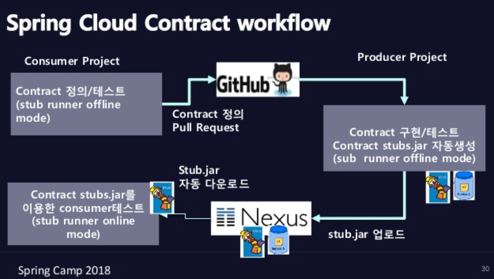
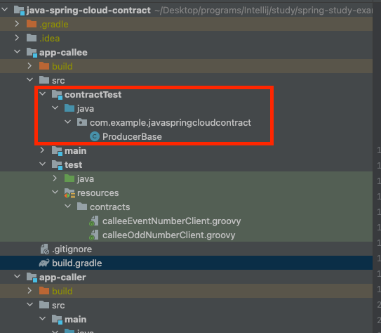
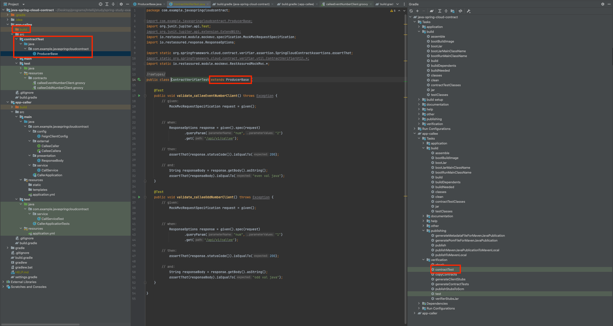
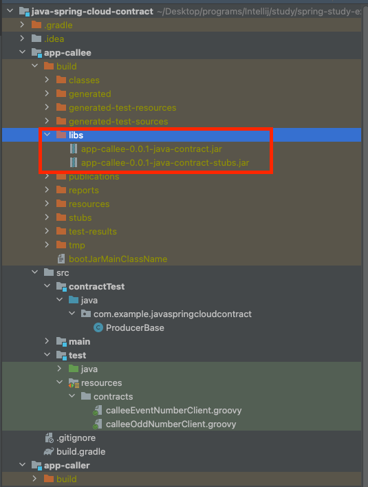

## 1. CDC(Consumer-Driven Contract)

### CDC(Consumer-Driven Contract) 정의

- 소비자(Consumer)의 요구사항 중심으로 제공자(Producer) 서비스를 진화시키기 위한 협업 패턴입니다
- Producer: API를 제공해주는 제공자
- Consumer: Producer가 제공한 API를 사용하는 소비자
- **스펙 정의, 문서화, 테스트, 스펙과 일치하는 테스트코드 유지, 모니터링/제어, Gateway**  드과 같이 여러 제약 사항이 존재하지만 유연한 커뮤니케이션이 부족하기 마련 입니다
- 그러므로 CDC를 유연하게 하기 위해서 Spring Cloud Contract 라는 오픈 소스가 개발 되었습니다

### 과거 CDC Test 방법

- E2E 테스트를 진행과 정에서는 주로 WiredMock과 같이 외부 API를 mocking 해서 처리 하였습니다
- 하지만 외부 API가 변경되더라도 mocking code가 변겨되지 않기 때문에 QA테스트가 필수되는 이관성 이슈가 발생합니다
- 그러므로 **Contract 정합성 유지**와 스펙과 일치하는 테스트 코드가 필요할 경우 Spring Cloud Contract를 응용할 수 있습니다

## 2. Spring Cloud Contract

### 정의

- MSA 환경에서 E2E 테스트를 위해서 만들어진 stub 기반 test 도구 입니다
- CDC(Consumer-Driven Contract)를 잘 이뤄질 수 있도록 Contract 공유 메커니즘을 제공

### Spring Cloud Contract Workflow



1. consumer는 contract를 정의하고, producer에게 제공
2. producer는 contract내용을 바탕으로 API 구현
3. producer의 contract 구현이 완성될 경우 application-stub.jar file을 생성, nexus 와 같은 maven 저장소에 upload

- stub을 특정 서버에 실행 시켜서 spring cloud eureka에 등록하여 사용할 수 있습니다

4. consumer는 자신이 요청한 contract기반으로 API 개발
5. consumer는 개발한 API를 stub을 자동으로 다운 받아(stub runner lib 이용) 테스트 진행

### Spring Cloud Contract 지원 범위

- API
- pub/sub Message Queue

## 3. Contract 작성

### Java project 필요 lib

1. main gradle 설정

```
buildscript {
    ext {
        springBootVersion = '2.7.3'
        springCloudContractDependenciesVersion = '3.1.4'
    }

    repositories {
        mavenCentral()
    }

    dependencies {
        classpath "org.springframework.boot:spring-boot-gradle-plugin:${springBootVersion}"
        classpath "io.spring.gradle:dependency-management-plugin:1.0.13.RELEASE"
        classpath "org.springframework.cloud:spring-cloud-contract-gradle-plugin:${springCloudContractDependenciesVersion}"
    }
}

//.... code

ext {
    set('springCloudVersion', "2021.0.4")
}


subprojects {
    apply plugin: 'java'
    apply plugin: 'org.springframework.boot'
    apply plugin: 'io.spring.dependency-management'
    apply plugin: 'spring-cloud-contract'
    apply plugin: 'maven-publish'


    dependencyManagement {
        imports {
            mavenBom "org.springframework.cloud:spring-cloud-dependencies:${springCloudVersion}"
        }
    }

    tasks.named('contractTest') {
        useJUnitPlatform()
    }
    // ... codes
}
```

2. producer gradle

```
bootJar { enabled = true }
jar { enabled = false }

publishing {
    publications {
        mavenJava(MavenPublication) {
            artifact(tasks.named("verifierStubsJar")) // stub jar file creation
            versionMapping { // version setting
                usage("java-api") { // java api setting version
                    fromResolutionOf("runtimeClasspath")
                }
                usage("java-runtime") {
                    fromResolutionResult(null)
                }
            }
        }
    }
}

dependencies {
    testImplementation 'org.springframework.cloud:spring-cloud-starter-contract-verifier'
}

contracts {
    baseClassForTests.set("com.example.javaspringcloudcontract.ProducerBase")
}
```

3. publishing

- 현재 gradle을 사용하기 때문에 maven의 `.m2` dir 내부에 jar file을 연동하지 않습니다.
- spring cloud contract에서는 **m2 dir를 통해서 stub file을 공유하므로** publising에 m2 dir로 전달 기능 구현 필요

4. spring-cloud-starter-contract-verifier: 아래에서 설명할 contract DSL(groovy file, yml file)을 읽어서 **rest API test code 자동 생성** 및 **stub file**을 생성하는 lib입니다

5. contracts

- spring cloud contract는 **RestAsssure**를 이용합니다. 그러므로 mock server를 띄울 base class를 정의 합니다
- 과거에는 test 에서 작성하면 되었지만 현재 main/test 과 같은 위치에 contractTest dir내부에 위치 시키시면 됩니다
- 만약 `spring-cloud-starter-contract-verifier` dependency를 추가하면 ide가 자동으로 인식합니다
  


6. Producer WireMock

```java

@AutoConfigureMessageVerifier
@SpringBootTest(webEnvironment = SpringBootTest.WebEnvironment.MOCK)
public class ProducerBase {
    @Autowired
    CalleController calleController;

    @BeforeEach
    void setup() {
        RestAssuredMockMvc.standaloneSetup(calleController);
    }
}
```

- mock server를 띄우기 위한 Base class 입니다
  
- 오른쪽 gradle에서 contractTest를 실행하게되면 현재 Groovy file을 읽어 자동으로 화면의 코드가 생성 됩니다
- 위치는 `build/generate-test-source` 입니다
- 결론적으로 자동으로 test code가 생성된다
- build를 하게 될 경우 일반 jar file과 **stub jar file**이 생성됩니다. 아래에서 설명할 Groovy file을 읽어서 wiremock을 새성해서 실행 가능한 stub file을 만드는 것 입니다
  

7. Consumer

```
dependencies {
    testImplementation "org.springframework.cloud:spring-cloud-starter-contract-stub-runner"
}
```

- stub을 wire mock으로 실행 하는 lib 입니다

```java
@SpringBootTest
@AutoConfigureWireMock
@AutoConfigureStubRunner(
        stubsMode = StubRunnerProperties.StubsMode.LOCAL,
        ids = {"com.example:app-callee:+:stubs:10010"}
)
class CallServiceTest {
    @Autowired
    CallService callService;

    @Test
    void callOddNumTest() {
        ResponseBody callData = callService.callData(2);

        assertThat(callData.getCode()).isEqualTo(200);
        assertThat(callData.getResult()).isEqualTo("even val java");
    }

    @Test
    void callEvenNumTest() {
        ResponseBody callData = callService.callData(1);

        assertThat(callData.getCode()).isEqualTo(200);
        assertThat(callData.getResult()).isEqualTo("odd val java");
    }
}
```

- stubsMode를 Local로 설정했기 때문에 local dir `.m2` dir위치에 stub file을  찾을것 입니다
- `com.example:app-callee:+:stubs:10010`은 stub file의 위치
  - format: `${group}:${artifact}:${version}:stubs:${port}` 입니다
  - 현재 version이 `+`로 표시되었기 때문에 최신 버전을 사용합니다
  - port는 stub이 실행할 port 입니다

### Kotlin project 필요 lib

1. gradle.properties

```
applicationVersion=0.0.1

projectGroup=com.example

kotlinVersion=1.6.21

kotlinLoggingVersion=2.1.20

# SpringBoot Dependency Version
springBootVersion=2.7.3
springDependencyManagementVersion=1.0.11.RELEASE

# spring cloud
springCloudVersion=2021.0.3
verifierVersion=3.1.3
kotlinVerifierVersion=3.0.3
```

2. gradle.kts

```
import org.jetbrains.kotlin.gradle.tasks.KotlinCompile

buildscript {
    val kotlinVerifierVersion: String by project
    // .. codes
    dependencies {
        classpath("org.springframework.cloud:spring-cloud-contract-spec-kotlin:$kotlinVerifierVersion")
    }
}

plugins {
    kotlin("jvm")
    kotlin("plugin.spring") apply false
    id("org.springframework.boot") apply false
    id("io.spring.dependency-management")
    id("maven-publish")
    id("org.springframework.cloud.contract") apply false
}

// codes...

subprojects {

    apply {
        plugin("org.springframework.boot")
        plugin("io.spring.dependency-management")
        plugin("java")
        plugin("kotlin")
        plugin("kotlin-spring")
        plugin("maven-publish")
        plugin("org.springframework.cloud.contract")
    }

    dependencyManagement {
        val springCloudVersion: String by project
        imports {
            mavenBom("org.springframework.cloud:spring-cloud-dependencies:${springCloudVersion}")
        }
    }
    
    // codes...
}
```

- java spring cloud contract 설정에서 차이점이 `spring-cloud-contract-spec-kotlin` kotlin 을 위한 contract lib를 추가해야 합니다

3. Producer Gradle

```
publishing {

    publications {
        create<MavenPublication>("mavenJava") {
//            artifact(tasks.named("bootJar"))
            artifact(tasks.named("verifierStubsJar")) // stub jar file creation
            versionMapping { // version setting
                usage("java-api") { // java api setting version
                    fromResolutionOf("runtimeClasspath")
                }
                usage("java-runtime") {
                    fromResolutionResult()
                }
            }
        }
    }
}

dependencies {
    testImplementation("org.springframework.cloud:spring-cloud-starter-contract-verifier")
    testImplementation("org.springframework.cloud:spring-cloud-contract-spec-kotlin")
}

contracts {
    baseClassForTests.set("com.example.springcloudcontract.ProducerBase")
}

```

- java와 차이점은 `spring-cloud-contract-spec-kotlin` 입니다 나머지는 모두 동일합니다

4. Consumer: java와 동일

### DSL 제공 파일 종류

- yml file
- Groovy file(사용할 방식)

### Groovy file

```groovy
package contracts

import org.springframework.cloud.contract.spec.Contract

Contract.make {
    description("even or odd value return")

    request {
        urlPath("/api/v1/callee") {
            queryParameters {
                parameter "num": value(2)
            }
        }
        method GET()
    }

    response {
        status OK()
        body(
                "even val java"
        )
    }
}
```

1.`description`: API 에대한 대한 설명을 추가

2. `request`: API request 명세
3. `response`: `status`(상태 코드)와 `body` 정의(json도 가능)

## 참고 사이트

- [spring cloud contract sample](https://github.com/spring-cloud-samples/spring-cloud-contract-samples)
- [kotlin setting 환경 설정](https://github.com/dev-kidult/spring-cloud-contract-study)
- [개발자 영상](https://www.youtube.com/watch?v=7F27S81enVo&t=2047s)
- [gradle publishing 설정](https://docs.gradle.org/current/userguide/publishing_maven.html)
