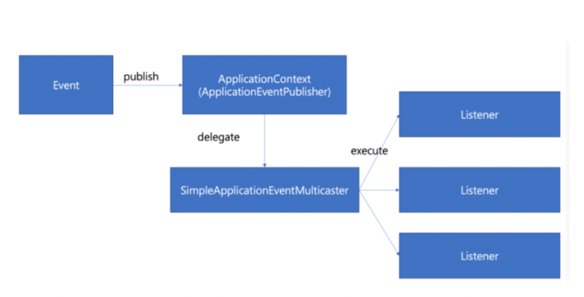

## EventListener

### 정의
- Event 객체를 spring 에서 제공해주는 publiser Bean의 1개의 Api를 호출할 경우 등록된 Event객체를 사용하는 listener의 비즈니스 로직을 모두 호출 하는 기능
- 비동기 처리 및 결합도가 높은 독립된 비즈니스 로직을 때어낼때 사용합니다

### 구성


- Bean 객체를 관리하는 ApplicationContext는 ApplicatioinEventPubliser interface를 상속 받습니다

```Java
public abstract class AbstractApplicationContext extends DefaultResourceLoader
        implements ConfigurableApplicationContext {
    protected void publishEvent(Object event, @Nullable ResolvableType eventType) {
        Assert.notNull(event, "Event must not be null");

        // Decorate event as an ApplicationEvent if necessary
        ApplicationEvent applicationEvent;
        if (event instanceof ApplicationEvent) {
            applicationEvent = (ApplicationEvent) event;
        } else {
            applicationEvent = new PayloadApplicationEvent<>(this, event);
            if (eventType == null) {
                eventType = ((PayloadApplicationEvent<?>) applicationEvent).getResolvableType();
            }
        }

        // Multicast right now if possible - or lazily once the multicaster is initialized
        if (this.earlyApplicationEvents != null) {
            this.earlyApplicationEvents.add(applicationEvent);
        } else {
            getApplicationEventMulticaster().multicastEvent(applicationEvent, eventType); // ApplicationEventMulticaster 위임
        }

        // Publish event via parent context as well...
        if (this.parent != null) {
            if (this.parent instanceof AbstractApplicationContext) {
                ((AbstractApplicationContext) this.parent).publishEvent(event, eventType);
            } else {
                this.parent.publishEvent(event);
            }
        }
    }
}
```

- `getApplicationEventMulticaster()` 라는 method를 통해서 `ApplicationEventMulticaster`를 가져오게 됩니다
- `ApplicationEventMulticaster`를 가져온 후 event 처리를 하게 됩니다

```Java
public abstract class AbstractApplicationContext extends DefaultResourceLoader
        implements ConfigurableApplicationContext {
    
    @Override
    public void refresh() throws BeansException, IllegalStateException {
        synchronized (this.startupShutdownMonitor) {
            
            // code...
            
            initApplicationEventMulticaster();
            
            // code...
        }
    }

    protected void initApplicationEventMulticaster() {
        ConfigurableListableBeanFactory beanFactory = getBeanFactory();
        if (beanFactory.containsLocalBean(APPLICATION_EVENT_MULTICASTER_BEAN_NAME)) {
            this.applicationEventMulticaster =
                    beanFactory.getBean(APPLICATION_EVENT_MULTICASTER_BEAN_NAME, ApplicationEventMulticaster.class);
            if (logger.isTraceEnabled()) {
                logger.trace("Using ApplicationEventMulticaster [" + this.applicationEventMulticaster + "]");
            }
        }
        else {
            this.applicationEventMulticaster = new SimpleApplicationEventMulticaster(beanFactory);
            beanFactory.registerSingleton(APPLICATION_EVENT_MULTICASTER_BEAN_NAME, this.applicationEventMulticaster);
            if (logger.isTraceEnabled()) {
                logger.trace("No '" + APPLICATION_EVENT_MULTICASTER_BEAN_NAME + "' bean, using " +
                        "[" + this.applicationEventMulticaster.getClass().getSimpleName() + "]");
            }
        }
    }
}
```

- ApplicationContext는 refresh(bean 객체를 생성 하고 DI하는)단계에서 `initApplicationEventMulticaster()`라는 method를 호출 하게 됩니다
- `initApplicationEventMulticaster()` 내부에서는 `SimpleApplicationEventMultiCaster`라는 객체를 직접 생성하게 됩니다

```Java
public class SimpleApplicationEventMulticaster extends AbstractApplicationEventMulticaster {
    @Override
    public void multicastEvent(final ApplicationEvent event, @Nullable ResolvableType eventType) {
        ResolvableType type = (eventType != null ? eventType : resolveDefaultEventType(event));
        Executor executor = getTaskExecutor();
        for (ApplicationListener<?> listener : getApplicationListeners(event, type)) {
            if (executor != null) {
                executor.execute(() -> invokeListener(listener, event));
            } else {
                invokeListener(listener, event);
            }
        }
    }
}
```
- 최종적으로 `getApplicationEventMulticaster().multicastEvent(applicationEvent, eventType)` 구문에서 `multicastEvent` method를 호출 하게 됩니다
- `SimpleApplicationEventMulticaster`는 지금까지 등록된 eventlistener중 event class와 matching listner들을 찾아서 API를 호출해주게 된다 



### 사용 사례

- 복잡한 도메인 사이에 강한 의존성을 제거하기 위해서 사용
    - 주문 서비스 개발, 혼합된 비지니스 로직
        - 주문 기능
        - 결제 기능
    - 주문 로직 안에 결제 로직을 넣어야 하는 경우가 발생
        - 주문 신청 -> 주문한 내용의 검증(재고 확인) -> 결제 -> 주문 완료
    - 현재 Order(주문) 라는 서비스에서 Pay(결제)라는 서비스는 분리되어야 의존성이 낮아 집니다
    - Order Service에 Pay Event Listener를 호출하는 형태로 진행하면 결합도를 낮출 수 있습니다
- 비동기 처리(메일 전달/slack notification 전달 등)에 사용
  - slack과 mail은 언제나 비즈니스 로직에서 때어낼 수 있는 로직이며 비동기로 처리할 수 있습니다
  - mail를 위한 서버가 존재할 경우 MQTT를 통해서 전달 할 수 있지만 모놀리식형태일 경우 eventlistener가 좋은 방식 입니다

