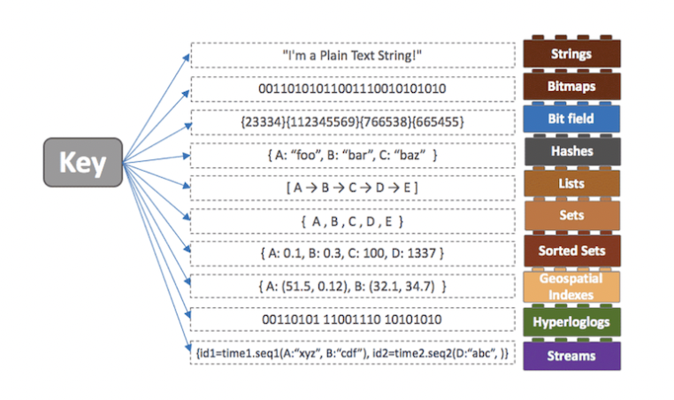

## 1. 정의
- key-value 형태로 데이터를 관리하는 오픈소스
- Redis는 빠른 속도와 간편한 사용법을제공 -> 캐시, 인증토큰, 섹션 관리 용도로 사용

## 2. 특징
- in-memory data structure store
  - 메모리에 데이터 저장 및 조회 -> 빠른 속도
- key - value 형태로 데이터 저장
- single thread 기반
- data 만료시간 지정 가능
- 여러가지 value type 설정가능
  - string, set, hash, list, bit field, sorted set ... etc
    

## 3. 자료구조 제공에 따른 편의성
### 개발의 편의성과 난이도 조절 가능
- ex1: ranking 기능 구현
  - 일반 RDB를 score값을 저장하고 데이터를 읽어 올때 sort를 해야함
  - sort 성능을 고려해야 함
  - redis는 sorted set을 제공: 기본적으로 sorting된 저장 공간 제공

### 트랜젝션 문제해결
- single thread이기 때문에 race condition을 피해 데이터 정합성 보장
- 모든 자료구조는 atomic

## Redis의 자료 구조
### string

- key와 연결할 수 있는 가장 간단한 유형의 값
- key는 문자열
- value도 문자열
- 모든 종류의 문자열(이진 데이터 포함)을 젖아할 수 있음
- 응용 사례: 이미지 저장, HTML fragment를 캐시해서 사용 가능
- 최대 사이즈 : 512MB
```
> set hello world
OK
> get hello
"world"
```

- string 정수로 파싱 후 atomic 하게 증감하는 command
```
> set counter 100
OK
> incr counter # string to int parsing 후 1 증가 후 다시 String 변환
(integer) 101
> incr counter
(integer) 102
> incrby counter 50
(integer) 152
```

- 기존에 있는 key에 새로운 값으로 변경

```
> INCR mycounter
(integer) 1
> GETSET mycounter "0" # mycounter 의 value 1 -> 0으로 변경
"1"
redis> GET mycounter
"0"
```

- key가 이미 존재하거나, 존재하지 않을 때만 데이터 저장
```
> set mykey newval nx # mykey가 nil 일 경우에만 할당 가능
(nil)
> set mykey newval xx # mykey가 nil일경우 할당 불가
OK
```

### List
- double linked list 의 특징을 가지고 있음
  - head/tail 에 push 할때 동일한 시간 소요
- 특정 index의 값을 삭제, 조회 가능

```
> LPUSH mylist A   # now the list is "A"
> LPUSH mylist B   # now the list is "B","A"
> RPUSH mylist A   # now the list is "A","B","A" (RPUSH was used this time)
```
- pub - sub(생산자-소비자) 패턴으로 가장 유용하게 사용 중인 요소
- `RPUSHX`를 사용하면 key가 이미 있을 때만ㅇ 데이터를 저장합니다. 이걸 사용하면 이미 존재하는 pub - sub 구조에서만 data 를 추가할 수 있음
- list에서 데이터가 없을 경우 null/nil 값이 반환됩니다 이때 `BRPOP`, `BLPOP` key time 을하게 되면 time 초 동안 data가 publish 될때 까지 기다렸다가 처리 합니다
- 여러번 polling 하지 않아도 되기 때문에 polling 프로세스를 줄일 수 있습니다

### Hash

- filed-value 쌍을 가지는 hashmap으로 이해하면 편합니다
- key에 대한 filed의 개수에는 제한이 없음
- RDB와 가장 비슷한 구조 key pk로 보고, filed를 하나의 column name, value를 실제 값으로 인식하면 하나의 table로 사용할 수 있습니다.
- value에 대해서 개별로 조작할수 있는 atomic한 함수도 제공

```
> hincrby user-1 birthyear 10 # user-1 이라는 key의 hash(filed: birthday - value: 1977)에서 value 1977에서 10을 증가 시키는 뜻
(integer) 1987
> hincrby user-1 birthyear 10
(integer) 1997
```

### Set

