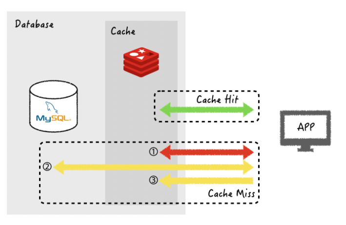
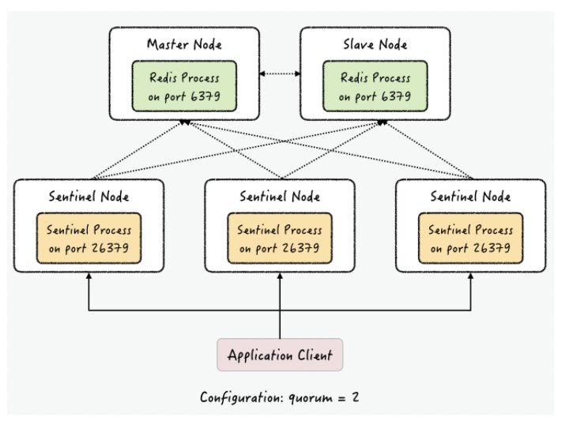

## 1. 정의
- key-value 형태로 데이터를 관리하는 오픈소스
- Redis는 빠른 속도와 간편한 사용법을제공 -> 캐시, 인증토큰, 섹션 관리 용도로 사용

## 2. 특징
- in-memory data structure store
  - 메모리에 데이터 저장 및 조회 -> 빠른 속도
- key - value 형태로 데이터 저장
- single thread 기반
- data 만료시간 지정 가능
- 여러가지 value type 설정가능
  - string, set, hash, list, bit field, sorted set ... etc
    

## 3. 자료구조 제공에 따른 편의성
### 개발의 편의성과 난이도 조절 가능
- ex1: ranking 기능 구현
  - 일반 RDB를 score값을 저장하고 데이터를 읽어 올때 sort를 해야함
  - sort 성능을 고려해야 함
  - redis는 sorted set을 제공: 기본적으로 sorting된 저장 공간 제공

### 트랜젝션 문제해결
- single thread이기 때문에 race condition을 피해 데이터 정합성 보장
- 모든 자료구조는 atomic

## Redis의 자료 구조
### string

- key와 연결할 수 있는 가장 간단한 유형의 값
- key는 문자열
- value도 문자열
- 모든 종류의 문자열(이진 데이터 포함)을 젖아할 수 있음
- 응용 사례: 이미지 저장, HTML fragment를 캐시해서 사용 가능
- 최대 사이즈 : 512MB
```
> set hello world
OK
> get hello
"world"
```

- string 정수로 파싱 후 atomic 하게 증감하는 command
```
> set counter 100
OK
> incr counter # string to int parsing 후 1 증가 후 다시 String 변환
(integer) 101
> incr counter
(integer) 102
> incrby counter 50
(integer) 152
```

- 기존에 있는 key에 새로운 값으로 변경

```
> INCR mycounter
(integer) 1
> GETSET mycounter "0" # mycounter 의 value 1 -> 0으로 변경
"1"
redis> GET mycounter
"0"
```

- key가 이미 존재하거나, 존재하지 않을 때만 데이터 저장
```
> set mykey newval nx # mykey가 nil 일 경우에만 할당 가능
(nil)
> set mykey newval xx # mykey가 nil일경우 할당 불가
OK
```

### List
- double linked list 의 특징을 가지고 있음
  - head/tail 에 push 할때 동일한 시간 소요
- 특정 index의 값을 삭제, 조회 가능

```
> LPUSH mylist A   # now the list is "A"
> LPUSH mylist B   # now the list is "B","A"
> RPUSH mylist A   # now the list is "A","B","A" (RPUSH was used this time)
```
- pub - sub(생산자-소비자) 패턴으로 가장 유용하게 사용 중인 요소
- `RPUSHX`를 사용하면 key가 이미 있을 때만ㅇ 데이터를 저장합니다. 이걸 사용하면 이미 존재하는 pub - sub 구조에서만 data 를 추가할 수 있음
- list에서 데이터가 없을 경우 null/nil 값이 반환됩니다 이때 `BRPOP`, `BLPOP` key time 을하게 되면 time 초 동안 data가 publish 될때 까지 기다렸다가 처리 합니다
- 여러번 polling 하지 않아도 되기 때문에 polling 프로세스를 줄일 수 있습니다

### Hash

- filed-value 쌍을 가지는 hashmap으로 이해하면 편합니다
- key에 대한 filed의 개수에는 제한이 없음
- RDB와 가장 비슷한 구조 key pk로 보고, filed를 하나의 column name, value를 실제 값으로 인식하면 하나의 table로 사용할 수 있습니다.
- value에 대해서 개별로 조작할수 있는 atomic한 함수도 제공

```
> hincrby user-1 birthyear 10 # user-1 이라는 key의 hash(filed: birthday - value: 1977)에서 value 1977에서 10을 증가 시키는 뜻
(integer) 1987
> hincrby user-1 birthyear 10
(integer) 1997
```

- 기본 문법

```
# 저장
> HSET hkey name kkh # 1개저장
> HMSET hkey age 25 workplace nhn # 여러개 저장(multiple)

# 읽기
> HGET hkey name # name 읽기
> HMGET hkey name age workplace # 여러 filed 읽기
> HGETALL hkey # hkey 내부 값 전체 읽기 filed - value 순으로 출력

# 제거
> HDEL hkey workplace name # filed 삭제
> DEL hkey # key 자체를 삭제
```

### Set
- 정렬되지 않은 문자열의 모음 입니다
- 중복 불가
- 교집합, 합집합, 차집합 연산 가능
- 객체 간의 간계를 표현할 때 좋음
  - 현재 project중 음식(post)와 재료(tag)로 쌍을 이루는 정보가 있습니다
  - 여기에 음식 내부에 tag정보를 mapping 시켜주는 것을 작성하게되면 아래와 같이 사용할 수 있습니다
  - ID가 10인 food 내부에 tag정보가 americano shot coffeee 3개 들어가 있습니다.
  - 만약 아래 예시에서 5개의 food 가 동일하게 가지고 있는 tag를 확인하고 싶을 경우 `sinter`를 사용할 수 있습니다.
  - 반대로 tag별로 분류해 놓은 tag:ID:foods로 설정할 경우 tag 1, 2, 5, 77이 가지고 있는 food를 손싶게 조회할 수 있습니다

```
> sadd food:10:tags americano shot coffeee

> smembers food:10:tags
1. americano
2. shot
3. coffeee
```

```
> sadd tag:1:foods 1000 1
(integer) 1
> sadd tag:2:foods 1000 2
(integer) 1
> sadd tag:5:foods 1000 3
(integer) 1
> sadd tag:77:foods 1000 4
(integer) 1
> sinter tag:1:projects tag:2:projects tag:5:projects tag:77:projects
1) 1000
```


### sorted set

- set과 마찬가지로 중복이 없는 집합 이지만 각 value 내부에는 score라는 값이 존재합니다.
- score(floating point value)에 맞춰서 sort 된 구조를 가집니다
- 주로 랭킹을 매기는 application에서 사용을 많이 합니다
- index 접근시 sorted set이 더 빠르게 접근이 됩니다(index 접근시 list보다 sorted set을 사용 권장)

```
# 추가
> zadd birthyear (NX) 0 jason # NX를 붙이면 jason이 존재하면 추가하지 않음, XX인 경우 존재하면 update하라는 뜻입니다
> zrange birthyear 0 -1 # 전체 값 조회
```

### Expire 기능(TTL)

- redis는 일정 시간이 지나면 Expire되어서 사라지는 기능 입니다
- 메모리가 한정적이기 때문에 삭제 시간을 미리 정의하는게 편리합니다
- 만약 동일한 키가 다시 들어오면 expire date가 다시 설정이 됩니다
- 처음: 30s, 현재 20s 인 data -> upate 및 생성 -> 30s로 다시 초기화

## Redis 캐시로 사용
### Look Aside(= Lazy Loading)

- 캐시를 옆에 두고 필요할 때만 데이터를 캐시에 로드하는 전략
- DB와 Application 사이에 위치
- DB정볼르 key-value로 저장
- Data 요청: application -> redis <miss> -> RDB 호출

### write-through
- DB에 데이터를 작성할 때마다 캐시에 데이터를 추가 및 update를 해주는 것 입니다
- 캐시 데이터 최신 상태를 유지 하는 장점 존재
- 데이터 입력 및 삭제 수정시 2번의 DB변경이 이뤄지기 때문에 성능 이슈 발생
- 미래에 사용하지 않을 수 있는 Data를 redis에 저장하는 오버헤드 추가(TTL 무조건 추가하기)

### Redis 활용 사례
1. 좋아요 구현

- 한 사용자가 post에 1번 좋아요를 할 수 있도록 하는 경우 redis를 사용해서 성능 개선이 가능합니다
- redis 에서 set을 이용해서 개선 가능합니다
- set은 중복 불 허용, 순서 없음 특징
- key로 post/food id값을 사용(ex: food:like:1 -> (userId 1, 2, 3, 15 ...))

## Redis 이중화

### Replication
- redis를 복재를 뜨기위 해서 사용합니다
- Master - Replica 구조
- 실시간으로 master에 있는 데이터를 replica에 복제
- master가 다운되더라도 리플리카 노드에 애플리케이션을 재연결해 주면 서비스 계속 가능
- replica는 여러개 존재 가능
- master는 무조건 한개
- 복제 방법
```
> replicaof 10.130.127.3 6001 # master node ip: 10.130.127.3, port: 6001  
```
- `replicaof`명령어는 master node에서 자식 프로세스를 만들어서 background로 dump file을 만듭니다
- 그리고 이를 네트워크를 통해 replica node에 전달
- replica node는 받은 정보를 node에 올린다
- 데이터 복제는 비동기 방식으로 진행
  - master에 데이터가 들어오면 마스터는 application에 ACK를 보낸다
  - 그 다음에 바로 replica node에 데이터 전달
    - 위와 같은 방식으로 처리하지 때문에 master가 replica에 data전달 전에 죽게 되면 data 유실이 될 수 있음
    - 이 과정이 너무 빨라서 거의 없는 상태로 여겨 집니다

### Sentinel
- Master Node가 죽게 되면 Application에 redis ip주소를 자동으로 replica node로 연결해야하도록 구현해야하는 이슈가 발생
- 자동으로 application과 연결한 IP가 replica node로 mapping되도록 할 수 있도록 도와주는게 sentinal 입니다

1. Sentinel 구성
- 마스터와 복제 노드를 계속 모니터링 진행
- master 장애가 발생시 자동으로 replica 중 1개를 master로 승격하는 자동 failover 진행
- 메일을 통해서 master가 죽었다고 노티를 보내는 것도 가능



- 정상 운영을 위해서는 3개의 sentiel 필요
  - 이유: 모든 master, replica node를 모니터링 하다가 failover가 필요할 경우 sentiel node가 전부 failover 할지 여부를 판단 -> 과반수 이상이면 failover을 진행하기 때문
    - network 통신 이슈가 발생해서 노드 승격하는 이슈를 방지하기 위해
- application은 실제 redis server(mster, replica) node에 직접 연결하지 않습니다
- sentiel node에 연결
  - sentiel은 master node의 ip, port를 알려줌

2. Failover 과정
- master node 가 죽는 장애 발생
- sentinel node들이 모니터링 하고있는 master node가 죽은걸 인지
- sentinel node끼리 투표 진행
- 과반수 이상일 경우 failover 진행
- replica node들은 master에 대한 복제 연결 모두 끊음
- replica node중 1개 master 승격
- 나머지 replica node들은 새로운 master node에 replica 연결
- 다운된 이전의 master node가 살아나면 replica node로서 현재 master node에 연결

### Cluster
- 정의: 데이터를 자동으로 분할하는 방법을 의미합니다
- 특징: 확장성, 고성능, 고가용성
  - 데이터셋을 여러 노드에 자동으로 분산(확장성, 고성능)
  - 일부 노드가 다운되어도 계속 사용가능(고가용성)
- 구성: 모든 node들이 fullmesh 형태로 연결되어있
- 가십 프로토콜을 이용해서 통신
- 최소 3개의 master node가 필요
- 분산 방법: sharding

### Sharding
- 정의: Application에서 들어오는 모든 데이터를 hash slot 에 저장하는 방식
- redis는 총 16384개의 slot이 존재
- master node들은 slot을 나눠서 저장
- 1번 matster node: 0 ~ 5500, 2번 master node: 5501 ~ 11000, 3번 masetr node: 10001 ~ 16383 hash slot 할당
- 입력되는 모든 key는 slot에 mapping됨
- hash slot은 master node간에 자유롭게 이동가능합니다 그리고 down time 이존재 하지않기 때문에(중간에 서비스 중지 하는 시간) 확장에 용의 합니다.
- 각 master node 는 복제 가능

### Cluster 구조 Failover
- Sentinel 프로세스가 master node들을 감시하지만, reids의 모든 노드가 서로를 감시합니다

### Client Redirection
- client는 복제 노드를 포함해서 모든 노드에 자유롭게 쿼리를 보낼 수 있습니다.
- 요청에서 해당 key가 존재하지 않으면 그 key가 존재하는 ndoe를 반환 redirect message를 반환 
- 지금 추상화된 redis lib를 사용할 경우 redirect message를 받으면 자동으로 바로 redirect 된 node로 데이터 조회합니다