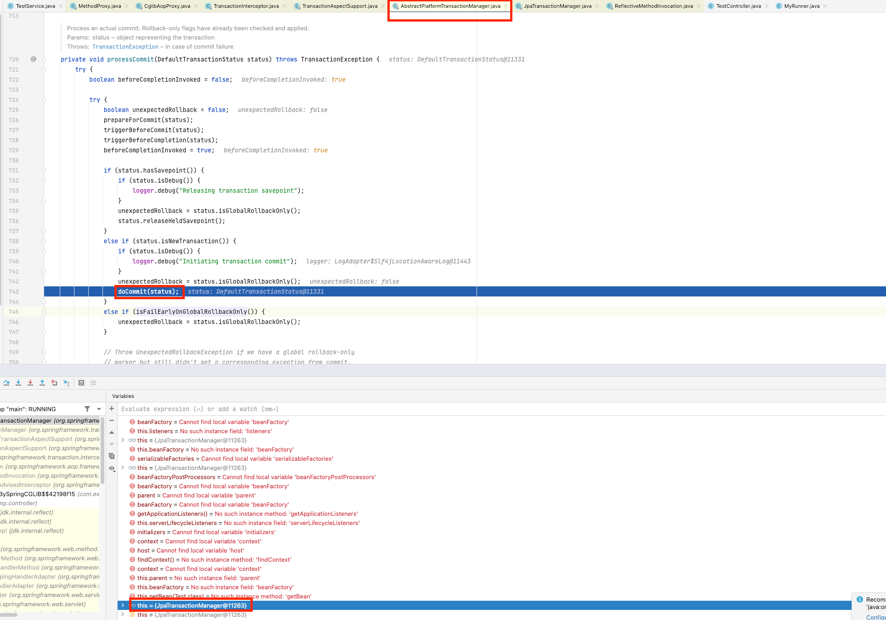
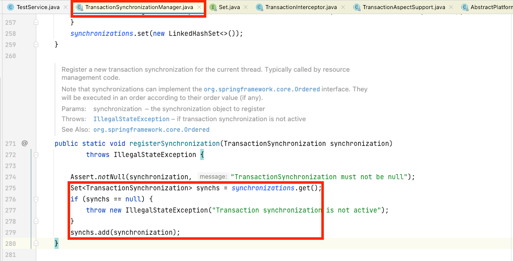
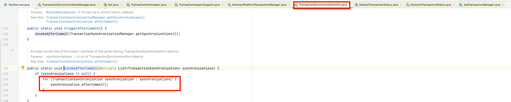

## 전체 로직 Flow

```java
public abstract class TransactionAspectSupport implements BeanFactoryAware, InitializingBean {
    @Nullable
    protected Object invokeWithinTransaction(Method method, @Nullable Class<?> targetClass,
                                             final InvocationCallback invocation) throws Throwable {
        TransactionAttributeSource tas = getTransactionAttributeSource();
        final TransactionAttribute txAttr = (tas != null ? tas.getTransactionAttribute(method, targetClass) : null);
        final TransactionManager tm = determineTransactionManager(txAttr); 
        // Aspect에 캐싱 되어있으면 Manager가져오게 됩니다 캐시된 아닐 경우 Bean transaction manager를 BeanFacotry에서 getBean으로 가져옵니니다
        // 현재 JPA를 사용하기 때문에 JpaTransactionManager를 가져옵니다
        
        // .. codes
        
        PlatformTransactionManager ptm = asPlatformTransactionManager(tm); // PlatformTransactionManager 형태로 형변환
        final String joinpointIdentification = methodIdentification(method, targetClass, txAttr);
        
        if (txAttr == null || !(ptm instanceof CallbackPreferringPlatformTransactionManager)) {
            // Standard transaction demarcation with getTransaction and commit/rollback calls.
            TransactionInfo txInfo = createTransactionIfNecessary(ptm, txAttr, joinpointIdentification); // transaction 을 생성 합니다, 이미 생성되어있을 경우 생성하지 않을 수 있습니다(type에 따라 다릅니다)

            Object retVal;
            try {
                // This is an around advice: Invoke the next interceptor in the chain.
                // This will normally result in a target object being invoked.
                retVal = invocation.proceedWithInvocation(); // 실제 개발자가 작성한 비즈니스 로직 실행
            } catch (Throwable ex) {
                // target invocation exception
                completeTransactionAfterThrowing(txInfo, ex); // rollback을 진행하는 구간
                throw ex;
            } finally {
                cleanupTransactionInfo(txInfo); // transactionInfoHolder 라는 thread local에 이전에 사용하던 txinfo정보를 저장합니다
            }

            if (retVal != null && vavrPresent && VavrDelegate.isVavrTry(retVal)) {
                // Set rollback-only in case of Vavr failure matching our rollback rules...
                TransactionStatus status = txInfo.getTransactionStatus();
                if (status != null && txAttr != null) {
                    retVal = VavrDelegate.evaluateTryFailure(retVal, txAttr, status);
                }
            }

            commitTransactionAfterReturning(txInfo); // commit혹은 rollback을 진행하는 로직이 포함 되어있습니다(아래 로직 참조)
            return retVal;
        }
        // .. codes

        protected void completeTransactionAfterThrowing(@Nullable TransactionInfo txInfo, Throwable ex) {
            if (txInfo != null && txInfo.getTransactionStatus() != null) {
                // .. codes
                
                if (txInfo.transactionAttribute != null && txInfo.transactionAttribute.rollbackOn(ex)) {
                    try {
                        txInfo.getTransactionManager().rollback(txInfo.getTransactionStatus()); // rollback 단계
                    }
                    catch (TransactionSystemException ex2) {
                        logger.error("Application exception overridden by rollback exception", ex);
                        ex2.initApplicationException(ex);
                        throw ex2;
                    }
                    catch (RuntimeException | Error ex2) {
                        logger.error("Application exception overridden by rollback exception", ex);
                        throw ex2;
                    }
                }
                else {
                    // We don't roll back on this exception.
                    // Will still roll back if TransactionStatus.isRollbackOnly() is true.
                    try {
                        txInfo.getTransactionManager().commit(txInfo.getTransactionStatus()); // commit 단계
                    }
                    catch (TransactionSystemException ex2) {
                        logger.error("Application exception overridden by commit exception", ex);
                        ex2.initApplicationException(ex);
                        throw ex2;
                    }
                    catch (RuntimeException | Error ex2) {
                        logger.error("Application exception overridden by commit exception", ex);
                        throw ex2;
                    }
                }
            }
        }
    }
}
```

## TransacationManager 조회 및 Transaction 생성

### TransactionManger가져오기

```java
public abstract class TransactionAspectSupport implements BeanFactoryAware, InitializingBean {
    @Nullable
    protected TransactionManager determineTransactionManager(@Nullable TransactionAttribute txAttr) {
        // Do not attempt to lookup tx manager if no tx attributes are set
        if (txAttr == null || this.beanFactory == null) {
            return getTransactionManager();
        }

        String qualifier = txAttr.getQualifier();
        if (StringUtils.hasText(qualifier)) {
            return determineQualifiedTransactionManager(this.beanFactory, qualifier);
        } else if (StringUtils.hasText(this.transactionManagerBeanName)) {
            return determineQualifiedTransactionManager(this.beanFactory, this.transactionManagerBeanName);
        } else {
            TransactionManager defaultTransactionManager = getTransactionManager();
            if (defaultTransactionManager == null) {
                defaultTransactionManager = this.transactionManagerCache.get(DEFAULT_TRANSACTION_MANAGER_KEY);
                if (defaultTransactionManager == null) {
                    defaultTransactionManager = this.beanFactory.getBean(TransactionManager.class); // bean factory에서 transaction manager 조회
                    this.transactionManagerCache.putIfAbsent(
                            DEFAULT_TRANSACTION_MANAGER_KEY, defaultTransactionManager);
                }
            }
            return defaultTransactionManager;
        }
    }

    private TransactionManager determineQualifiedTransactionManager(BeanFactory beanFactory, String qualifier) { // qualifier로 transaction manager를 새로등록 한 경우
        TransactionManager txManager = this.transactionManagerCache.get(qualifier);
        if (txManager == null) {
            txManager = BeanFactoryAnnotationUtils.qualifiedBeanOfType(
                    beanFactory, TransactionManager.class, qualifier);
            this.transactionManagerCache.putIfAbsent(qualifier, txManager);
        }
        return txManager;
    }
}
``` 
- trnasaction manager를 새로 생성해서 등록하지 않게 됨녀 기본 default로 생성된 transacation manager를 bean으로 가져옵니다
- BeanFactory는 하나의 type으로 여러개의 Bean을 등록할 수 있습니다 그러므로 개발자가 직접 작성한 TransacationManager를 불로오고 싶다면 `determineQualifiedTransactionManager`를 호출해서 transaction manager를 가져오게 됩니다
- transaction manager는 transaction을 생성하고 전체 flow를 설정하기 때문에 한번 호출하게 되면 캐싱해서 바로 사용할 수 있습니다
- 현재 jpa를 사용하기 때문에 JpaTransactionManager를 사용합니다

```java
@Configuration
public class TransactionConfig {
    @Bean
    public TransactionManager txManager() {
        return new JpaTransactionManager();
    }
}


@Service
class Service {
    // ..codes
    @Transactional("txManager") 
    public void helloMethod() {
        // .. codes
    }
}
```

- 현재 코드에서는 txManager qualifier bean객체를 가져오게 됩니다

### Transaction 생성
```java
public abstract class TransactionAspectSupport implements BeanFactoryAware, InitializingBean {
    @SuppressWarnings("serial")
    protected TransactionInfo createTransactionIfNecessary(@Nullable PlatformTransactionManager tm,
                                                           @Nullable TransactionAttribute txAttr, final String joinpointIdentification) {

        // If no name specified, apply method identification as transaction name.
        if (txAttr != null && txAttr.getName() == null) {
            txAttr = new DelegatingTransactionAttribute(txAttr) {
                @Override
                public String getName() {
                    return joinpointIdentification;
                }
            };
        }

        TransactionStatus status = null;
        if (txAttr != null) {
            if (tm != null) {
                status = tm.getTransaction(txAttr); // 기존에 transaction이 설정되어있을 경우 기존 transaction 사용
            } else {
                if (logger.isDebugEnabled()) {
                    logger.debug("Skipping transactional joinpoint [" + joinpointIdentification +
                            "] because no transaction manager has been configured");
                }
            }
        }
        return prepareTransactionInfo(tm, txAttr, joinpointIdentification, status);
    }
}
```
- 해당 로직을 통해 transaction 생성과 현재 transaction의 정보를 담고 있는 TransactionInfo에 객체에 정보를 저장합니다

## completeTransactionAfterThrowing 단계
### commit 단계

- abstract class에 전체 flow 설정하고 개별 비즈니스 로직을 자식 클래스에 정의하는 template method 패턴을 사용해서 구현 되어있습니다
- 현재 JPA를 사용하기 때문에 `JPATransactionManger`를 사용합니다


### Syncronization 객체내부의 함수 실행
1. Syncronization 정의
- commit/rollback과 같은 transaction 라이프 사이클이 실행 과정에서 추가 로직을 등록하기 위해서 사용합니다
- TranascationSyncronization과 같은 객체는 static 변수와 method만 포함되어있는 `TransactionSynchronizationManager`를 통해서 등록하고 실행 됩니다
- `init**`/`set**` static method를 통해서 thread local 변수들을 정의 합니다
- read only인지 여부를 저장한다든지, 아니면 transaction commit/rollback이후에 추가로직을 호출할 수 있도록 syncronization객체를 등록할 수 있습니다

2. Sync 객체 등록 방법
```java
@Service
@RequiredArgsConstructor
public class TestService {
    private final HelloRepository helloRepository;

    @Transactional
    public void helloMethod() {
        helloRepository.save(new Hello("owaowa"));
        TransactionSynchronizationManager.registerSynchronization(
                new TransactionSynchronizationAdapter() {
                    @Override
                    public void afterCompletion(int status) {
                        System.out.println(status);
                    }
                });
    }
}
```



- 해당 `TransactionSynchronizationAdapter` 객체는 `registerSynchronization`통해 thread local에 있는 Set 객체에 등록됩니다
- 해당 Thread local 변수인 synchronizations에 저장됩니다

3. triggerAfterCommit: commit이후에 앞에 설명한 1,2번을 통해서 등록한 sync 객체의 callback함수를 호출하게 됩니다
```java
public abstract class AbstractPlatformTransactionManager implements PlatformTransactionManager, Serializable {
    private void triggerAfterCommit(DefaultTransactionStatus status) {
        if (status.isNewSynchronization()) {
            TransactionSynchronizationUtils.triggerAfterCommit();
        }
    }
}
```


- 위 사진을 보면 `triggerAfterCommit`은 아래 사각형과 같이 `invokeAfterCommit` method를 호출하여 callback함수를 호출하게 됩니다
- redis와 nosql을 사용할 경우 rollback 기능을 제공하지 않기 떄문에 rollback기능을 간략하게 구현해서 추가할 수 있습니다

### cleanupAfterCompletion
- `TransactionSynchronizationManager` 객체 내부에 가지고있던 thread local정보를 제거합니다
- 만약 제거하지 않으면 메모리 leak이 발생할 수 있습니다

```java
public abstract class TransactionSynchronizationManager {
    public static void clear() {
        synchronizations.remove();
        currentTransactionName.remove();
        currentTransactionReadOnly.remove();
        currentTransactionIsolationLevel.remove();
        actualTransactionActive.remove();
    }
}
```

- EntityManager가 가지고 있는 transaction 자원 할당 해제

```java
public class EntityManagerHolder extends ResourceHolderSupport {
    @Override
    public void clear() {
        super.clear();
        this.transactionActive = false;
        this.savepointManager = null;
    }
}
```

- ConnectionPool