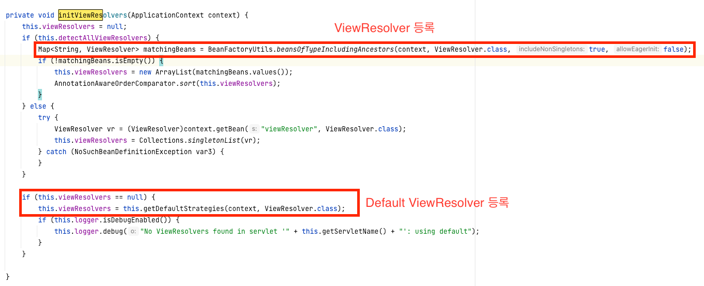

# Servlet과 Listener

## Servlet

### 정의
- 사용자의 웹 요청을 처리하고 결과를 반환 하는 기술을 의미

### Spring Mvc
- Servlet 기반 web application을 쉽게 만들 수 있게 도와주는 framework

## Listener

### 정의
- Observer pattern을 사용해서 변경을 감지하여 이벤트 handling을 하는 것을 의미합니다

### 종류
- ServletContextListener
- SessionListener

### ServletContextListener
- Context의 life cycle을 감지 하는 기능을 제공
- web application의 시작과 종료시 contextInitialized(), contextDestoryed()를 자동으로 실행하여 web application의 시작과 종료의 이벤트를 감지하는 역할을 합니다
- Spring에서는 `ContextLoaderListener`라는 `ServletContextListener` interface를 구현하고, `ContextLoader`를 상속받은 listener를 사용합니다

### ContextLoaderListener
- `ServletContextListener` interface를 구현하고, `ContextLoader`를 상속받은 listener입니다
- `ServletContextListener`: ServletContext의 라이프 사이클을 감지하는 interface
- `ContextLoader`: RootApplicationContext 생성과 ServletContext에 RootApplicationContext등록 및 삭제 로직이 들어있는 클래스 
- 정의: `ServletContext`라이프 사이클에 맞춰서 `ApplicationContext`를 생성하고, `ServletContext`에 `ApplicationContext`를 설정 및 삭제를 진행합니다
- ApplicationContext를 생성하는 로직은 ContextLoader에 있습니다 ContextLoaderListener는 단지 ServletContext Life cycle을 인지(event로 주입 받은 ServletContext)해서 ContextLoader의 메서드를 호출하는 역할을 합니다
- ServletContext에 ApplicationContext를 등록하기 위해서는 ApplicationContext의 class type정보(ApplicationContext.class)와 config 파일 위치가 필요합니다
  - 위 class정보와 config location정보는 contextClass와 contextConfigLocation를 통해서 받을 수 있습니다 

### contextClass와
- ContextLoader에서 생성할 IoC Container(RootApplicationContext) 클래스 type의 이름을 의미 합니다
- annotataion 기반으로 Bean을 등록할 경우 AnnotataionConfigWebApplicationContext가 contextClass가 됩니다

### contextConfigLocation
- IoC Container의 설정 파일의 위치를 의미 합니다
- xml 위치, java class위치 ... etc

### Servlet과 ServletContextListener 생성 과정
1. Tomcat이 뜨면서 `web.xml`에 작성된 `Servlet Context`의 라이프 사이클에 맞춰서 init method와 destory method가 호출 됩니다
2. `web.xml`에 정의된 url에 매칭된 Servlet 객체를 미리 생성 합니다(재상용성이 높기 떄문에 한번 생성후 재사용 됩니다. 그리고 web container가 죽을 때 자원이 해제 됩니다)

- code
```java
// listnener 추가
public class MyListener implements ServletContextListener {
    @Override
    public void contextInitialized(ServletContextEvent sce) {
        System.out.println("Context가 초기화 되었습니다");
        sce.getServletContext().setAttribute("name", "test data");
    }

    @Override
    public void contextDestroyed(ServletContextEvent sce) {
        System.out.println("Context가 종료 되었습니다.");
    }
}

// servlet 추가
public class HelloServlet extends HttpServlet {
    @Override
    public void init() throws ServletException {
        super.init();
        System.out.println("init");
    }

    @Override
    public void destroy() {
        super.destroy();
        System.out.println("destory");
    }

    @Override
    protected void doGet(HttpServletRequest req, HttpServletResponse resp) throws ServletException, IOException {
        System.out.println("do Get data");
        resp.getWriter().println("<html><body>");
        resp.getWriter().println("<h1>Hello Header</h1>");
        resp.getWriter().println("input data " + getServletContext().getAttribute("name"));
        resp.getWriter().println("</html></body>");
    }
}
```

- web.xml
```xml
<?xml version="1.0" encoding="UTF-8"?>
<web-app xmlns="http://xmlns.jcp.org/xml/ns/javaee"
         xmlns:xsi="http://www.w3.org/2001/XMLSchema-instance"
         xsi:schemaLocation="http://xmlns.jcp.org/xml/ns/javaee http://xmlns.jcp.org/xml/ns/javaee/web-app_4_0.xsd"
         version="4.0">
    <listener>
        <listener-class>org.example.webmvc.MyListener</listener-class>
    </listener>
    <servlet>
        <servlet-name>helloServlet</servlet-name>
        <servlet-class>org.example.webmvc.HelloServlet</servlet-class>
    </servlet>
    <servlet-mapping>
        <servlet-name>helloServlet</servlet-name>
        <url-pattern>/</url-pattern>
    </servlet-mapping>
</web-app>
```


## ServletContext
### 정의
- 하나의 servlet이 servlet container와 통신하기 위해서 사용되어지는 method들이 존재는 class
- 각 Application마다 1개를 가지게 됩니다
- Application공통 자원이나 정보를 미리 바인딩 해서 서블릿들이 공유하여 사용할 수 있게 해주는 것입니다

### 작업 종류
- 다른 Servlet의 정보를 가져오는 것이 가능(servlet cotainer랑 상호 작용하기 때문) 
- Servlet에서 file에 접근가능
- file의 MIME type을 얻는 일 -> getMineType()
- log file에 기록 가능 -> log()
- servlet자체의 정보를 얻어내는 일 -> getServletInfo()
- servlet의 가상디렉토리상의 실제 경로를 얻는 일 -> getRealPath()
- servlet의 버전 확인 -> getMajorVersion(), getMinorVersion()

## ApplicationContext

### 정의
- ContextLoaderListner로 부터 생성되고, ServletContext에 등록 됩니다
- 계층 구조를 가짐
  - ServletApplicationContext
  - RootApplicationContext

### RootApplicationContext
- WebApplicationContext는 ApplicationContext를 상속받아서 만든 것입니다
- 모든 Servlet이 사용이 가능합니다

### ServletApplicationContext
- DispatcherServlet에서 RootWebApplicationContext를 상속받아서 만든 ApplicationContext입니다
- DispathcerServlet 내부에서만 사용 됨

### 계층 구조를 가지는 이유
- RootWebApplicationContext는 모든 Servlet에서 공용으로 사용가능하게 보이는 Service와 repository Bean이 등록되어 있습니다
- Dispatcherservlet이 여러개가 필요한 Application이 있을 수도 있기 때문에 RootApplicatonContext을 여러 servlet이 공유할 수 있도록 구현 되어있습니다

### ServletApplictionContext의 오해
- Controller와 HandlerMapping와 같은 객체는 주로 ServletApplicationContext에 존재한다고 나와있습니다
- 위와 같은 케이스는 web.xml에 등록하는 방식으로 사용할 경우 입니다
- @ComponentScan을 통해서 @RestController/@Controller로 Bean을 등록할 경우 WebApplicationContext에 등록이 됩니다 

### WebApplicationContext 계층 구조 만들기
- @ComponentScan을 사용해서 Controller를 Bean으로 등록할 경우 RootWebApplicationContext에 등록이 됩니다 이것을 계층구조로 변경해야하는경우가 있습니다
  - DispatcherServlet을 여러개 두는 경우
- ComponentScan에 코드추가

- RootApplicationContext 설정

```java
import org.springframework.context.annotation.ComponentScan;
import org.springframework.context.annotation.Configuration;

@Configuration
@ComponentScan(execludeFilters = @ComponentScan.Filter(Controller.class))
public class AppConfig {
}
```

- ServletApplicationContext 설정

```java
import org.springframework.context.annotation.ComponentScan;
import org.springframework.context.annotation.Configuration;

@Configuration
@ComponentScan(useDefaultFilters = false, includeFilters = @ComponentScan.Filter(Controller.class))
public class WebConfig {
}
```

### HandlerMapping
- 해당 요청이 어느 controller에 전달할지 정해줍니다
- 해당 객체의 어떤 method를 호출할지 정해줍니다
- HandlerMapping을 등록하지 않아도 default로 dispatcher servlet이 등록 합니다
  - error message와 error page를 띄울때 사용합니다

### HandlerInterceptor
- dispatcher servlet이 HandlerAdapter를 통해서 handler(controller)를 실행하기전 후로 데이터를 가공 및 처리할때 사용 합니다


### HandlerAdapater
- HandlerMapping로 부터 얻어온 handler class/method정보를 통해서 실제 비즈니스 로직(handle method)을 호출 합니다
- 그리고 ModelAndView객체로 반환 합니다
  - RestController인 경우 내부에 View객체는 없습니다

### ModelAndView
- client에게 반환할 데이터 정보를 담당하는 객체 입니다
- RestController인 경우 View 객체가 없습니다
- Controller인경우 html/jsp 파일 명정보와 내부에 넣을 데이터 model객체를 담은 객체 입니다

### ViewResolver
- ModelAndView에 정의된 html/jsp파일에 집어 넣어주는 역할을 담당합니다
- 응답에 대한 rendering을 담당합니다
- 아무 resolver를 등록하지 않을 경우 dispatcher servlet이 default ViewResolver를 등록합니다(InternalResourceViewResolver)
  - jsp를 지원하는 resolver 입니다


